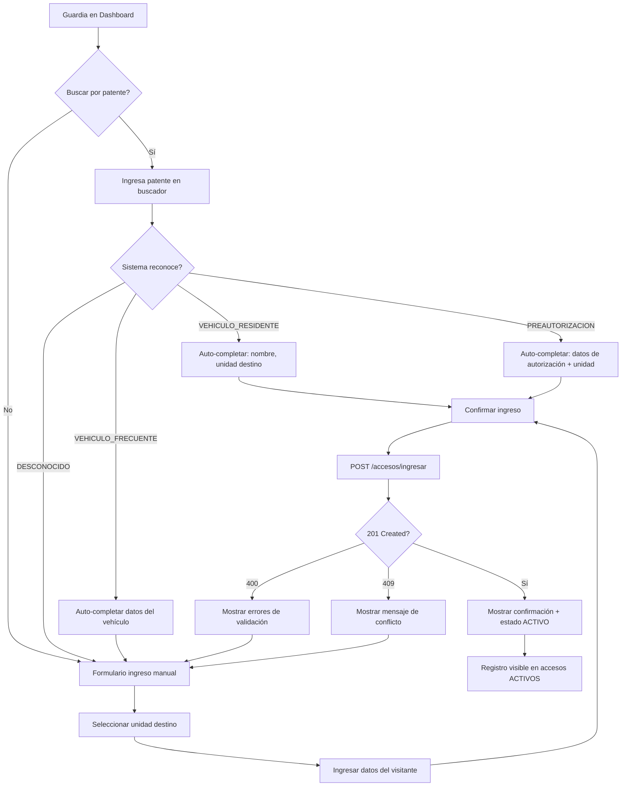
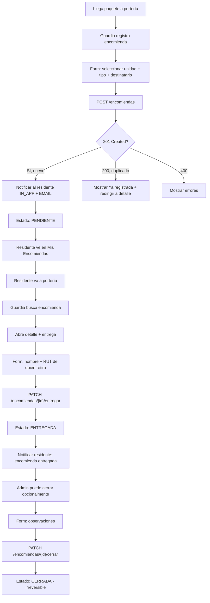
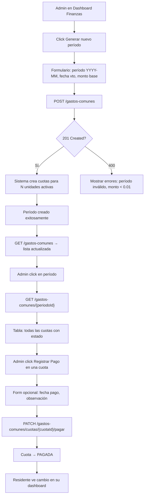
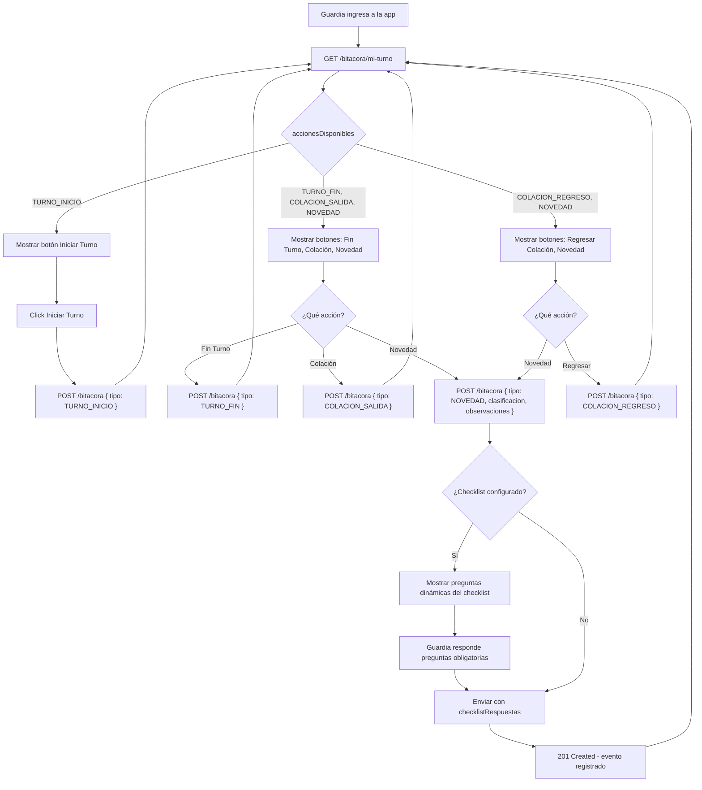
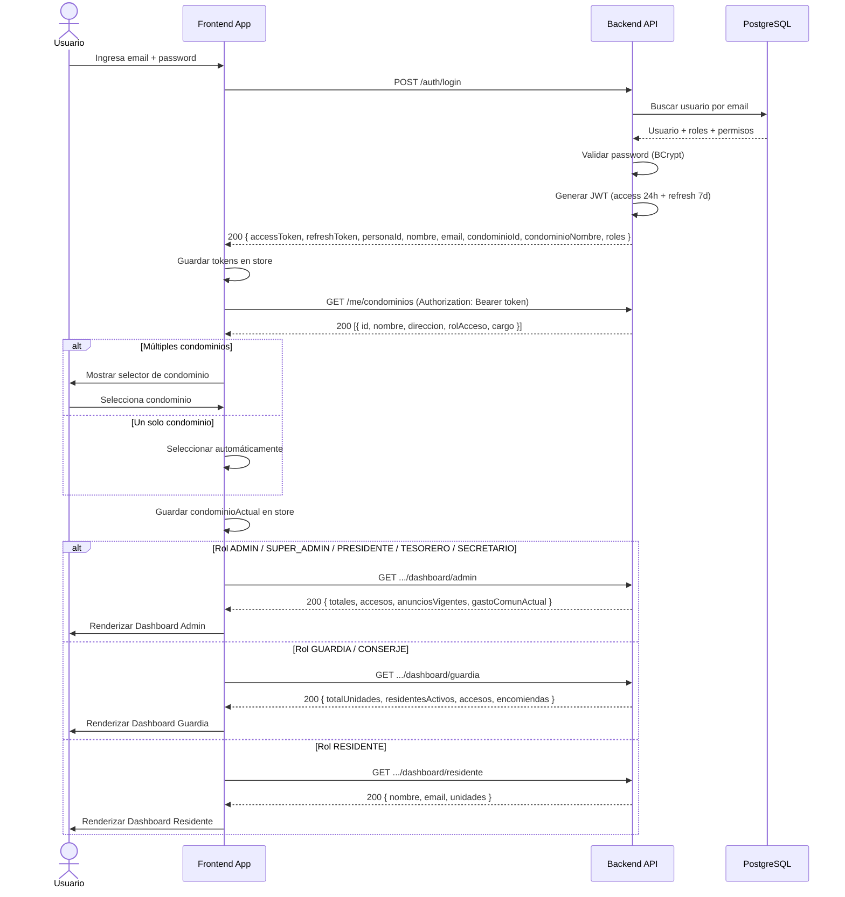
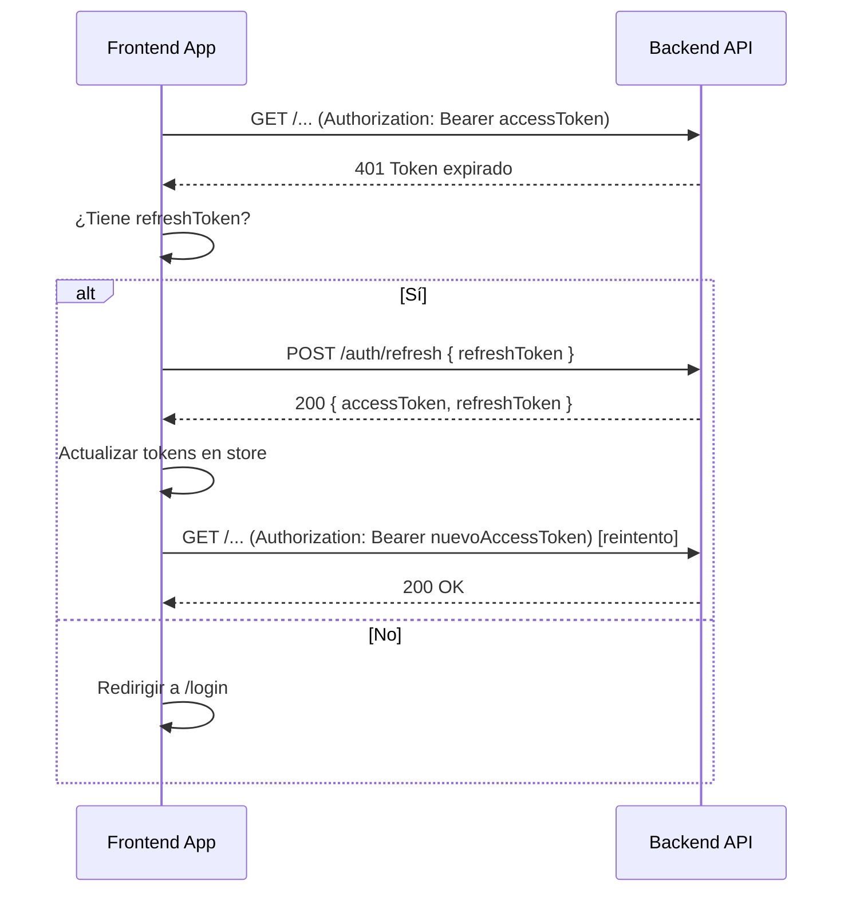
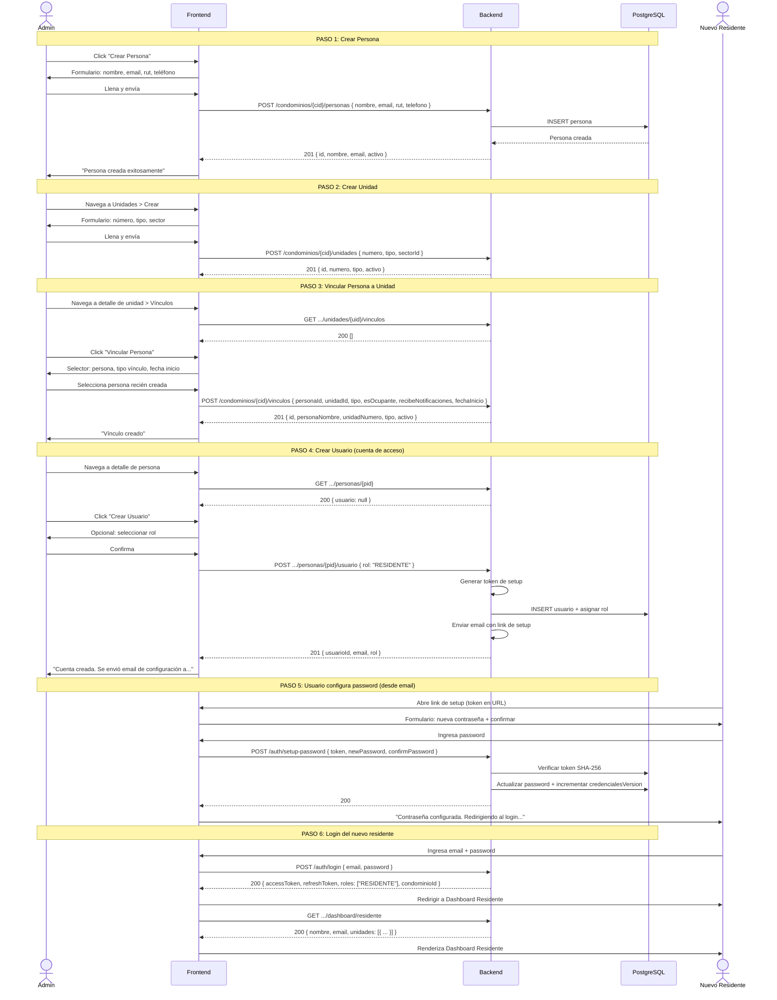

# ESPECIFICACIÓN DE PRODUCTO Y NAVEGACIÓN: SAAS CONDOMINIO

> **Versión:** 1.2  
> **Cambios v1.2:** Nuevo módulo Finanzas v2: cuentas financieras, categorías de movimiento, ledger inmutable (append-only), pagos de residentes, cargos adicionales, gastos (con anulación reverso contable), plantillas de gasto, dashboard financiero detallado y deudas del residente. 18 permisos granulares (V19).  
> **Cambios v1.1:** Validación de fechas en autorizaciones (auto-expand +6h si fechaFin == fechaInicio), `fechaInicio` como informativa en ingreso, fix de transacción en notificaciones.  
> **Propósito:** Guía para UI/UX, especificación técnica para frontend, y contexto para IA generadora de código.  
> **Proyecto:** Comunidad — Plataforma SaaS para Administración de Condominios  
> **Backend:** Spring Boot 4.0.5 / Java 17 / PostgreSQL 16 / JWT

---

## 1. Matriz de Roles y Permisos (RBAC)

El sistema implementa un modelo de permisos basado en **códigos de permiso** evaluados vía `CustomPermissionEvaluator` con `@PreAuthorize("hasPermission(null, 'CODIGO')")`. Los roles (`Rol`) son conjuntos de permisos. Adicionalmente existen **cargos organizacionales** (`CargoCondominio`) cuyos permisos se suman a los del rol. Permisos efectivos = permisos(rol) ∪ permisos(cargo activo).

### 1.1 Roles del Sistema

| Rol Código      | Nombre              | Descripción                                                         |
| --------------- | ------------------- | ------------------------------------------------------------------- |
| `SUPER_ADMIN`   | Super Administrador | Acceso global a todos los condominios. Puede asignar cualquier rol. |
| `SOPORTE`       | Soporte Técnico     | Acceso de lectura/auditoría global, sin acceso a finanzas.          |
| `ADMINISTRADOR` | Administrador       | Gestión operativa completa de un condominio específico.             |
| `GUARDIA`       | Guardia / Conserje  | Portería: accesos, encomiendas, bitácora.                           |
| `RESIDENTE`     | Residente           | Propietario, arrendatario o residente de una unidad.                |

### 1.2 Permisos del Sistema (62 códigos)

| Código                      | Módulo         | Descripción                                        |
| --------------------------- | -------------- | -------------------------------------------------- |
| `DASHBOARD_ADMIN`           | Dashboard      | Dashboard administrativo del condominio            |
| `DASHBOARD_FINANZAS`        | Dashboard      | Dashboard financiero                               |
| `DASHBOARD_TESORERO`        | Dashboard      | Dashboard financiero detallado (saldos, morosidad) |
| `DASHBOARD_GUARDIA`         | Dashboard      | Dashboard operativo de portería                    |
| `DASHBOARD_RESIDENTE`       | Dashboard      | Dashboard personal del residente                   |
| `PERSONA_VER`               | Personas       | Listar y ver detalle de personas                   |
| `PERSONA_CREAR`             | Personas       | Crear nuevas personas                              |
| `PERSONA_EDITAR`            | Personas       | Editar personas existentes                         |
| `PERSONA_ELIMINAR`          | Personas       | Desactivar personas (soft delete)                  |
| `UNIDAD_VER`                | Unidades       | Listar y ver detalle de unidades                   |
| `UNIDAD_CREAR`              | Unidades       | Crear nuevas unidades                              |
| `UNIDAD_EDITAR`             | Unidades       | Editar unidades                                    |
| `UNIDAD_ELIMINAR`           | Unidades       | Desactivar unidades                                |
| `VINCULO_VER`               | Vínculos       | Ver vínculos persona-unidad                        |
| `VINCULO_CREAR`             | Vínculos       | Crear vínculos                                     |
| `VINCULO_EDITAR`            | Vínculos       | Editar vínculos                                    |
| `VINCULO_ELIMINAR`          | Vínculos       | Desactivar vínculos                                |
| `VEHICULO_VER`              | Vehículos      | Listar vehículos                                   |
| `VEHICULO_CREAR`            | Vehículos      | Crear vehículos                                    |
| `VEHICULO_EDITAR`           | Vehículos      | Editar vehículos y asignar estacionamiento         |
| `VEHICULO_ELIMINAR`         | Vehículos      | Desactivar vehículos                               |
| `ACCESO_VER`                | Accesos        | Ver registros de acceso                            |
| `ACCESO_REGISTRAR_INGRESO`  | Accesos        | Registrar ingreso de visitante                     |
| `ACCESO_REGISTRAR_SALIDA`   | Accesos        | Registrar salida de visitante                      |
| `AUTORIZACION_VER`          | Autorizaciones | Ver autorizaciones                                 |
| `AUTORIZACION_CREAR`        | Autorizaciones | Crear pre-autorizaciones                           |
| `AUTORIZACION_CANCELAR`     | Autorizaciones | Cancelar autorizaciones                            |
| `ENCOMIENDA_VER`            | Encomiendas    | Ver encomiendas                                    |
| `ENCOMIENDA_CREAR`          | Encomiendas    | Registrar encomiendas                              |
| `ENCOMIENDA_ENTREGAR`       | Encomiendas    | Entregar y cerrar encomiendas                      |
| `RECLAMO_VER`               | Reclamos       | Ver reclamos                                       |
| `RECLAMO_CREAR`             | Reclamos       | Crear reclamos                                     |
| `RECLAMO_GESTIONAR`         | Reclamos       | Gestionar reclamos                                 |
| `RESERVA_VER`               | Reservas       | Ver reservas                                       |
| `RESERVA_CREAR`             | Reservas       | Crear reservas                                     |
| `RESERVA_CANCELAR`          | Reservas       | Cancelar reservas                                  |
| `FINANZA_VER`               | Finanzas       | Ver gastos comunes (períodos y cuotas)             |
| `FINANZA_GESTIONAR`         | Finanzas       | Gestionar períodos y pagos de gastos comunes       |
| `CUENTA_VER`                | Finanzas       | Consultar cuentas financieras                      |
| `CUENTA_GESTIONAR`          | Finanzas       | Crear y editar cuentas financieras                 |
| `CATEGORIA_VER`             | Finanzas       | Consultar categorías de ingresos y egresos         |
| `CATEGORIA_GESTIONAR`       | Finanzas       | Crear y editar categorías de movimiento            |
| `LEDGER_VER`                | Finanzas       | Consultar historial de transacciones (libro mayor) |
| `PAGO_RESIDENTE_VER`        | Finanzas       | Consultar pagos de residentes                      |
| `PAGO_RESIDENTE_CREAR`      | Finanzas       | Registrar pago recibido de un residente            |
| `GASTO_VER`                 | Finanzas       | Consultar egresos y gastos del condominio          |
| `GASTO_CREAR`               | Finanzas       | Registrar un egreso o gasto                        |
| `GASTO_ANULAR`              | Finanzas       | Anular un gasto (genera reverso en ledger)         |
| `PLANTILLA_GASTO_VER`       | Finanzas       | Consultar plantillas de gastos frecuentes          |
| `PLANTILLA_GASTO_GESTIONAR` | Finanzas       | Crear y editar plantillas de gastos                |
| `CARGO_ADICIONAL_VER`       | Finanzas       | Consultar multas y cargos extraordinarios          |
| `CARGO_ADICIONAL_GESTIONAR` | Finanzas       | Crear, editar y anular cargos adicionales          |
| `MANTENCION_VER`            | Finanzas       | Consultar mantenciones del condominio              |
| `MANTENCION_GESTIONAR`      | Finanzas       | Crear y actualizar estado de mantenciones          |
| `MIS_DEUDAS_VER`            | Finanzas       | Ver deudas propias como residente                  |
| `NOTIFICACION_VER`          | Notificaciones | Ver notificaciones y preferencias                  |
| `NOTIFICACION_ENVIAR`       | Notificaciones | Publicar anuncios                                  |
| `CONDOMINIO_VER`            | Condominio     | Ver datos del condominio                           |
| `CONDOMINIO_EDITAR`         | Condominio     | Editar configuración (plantillas)                  |
| `USUARIO_GESTIONAR`         | Usuarios       | Crear/activar/desactivar cuentas y asignar cargos  |
| `ROL_GESTIONAR`             | Roles          | Asignar y revocar roles                            |

### 1.3 Matriz Rol → Permisos

| Permiso                                         | SUPER_ADMIN | ADMIN | GUARDIA          | RESIDENTE | SOPORTE  |
| ----------------------------------------------- | ----------- | ----- | ---------------- | --------- | -------- |
| `DASHBOARD_ADMIN`                               | ✓           | ✓     |                  |           | ✓        |
| `DASHBOARD_FINANZAS`                            | ✓           | ✓     |                  |           |          |
| `DASHBOARD_GUARDIA`                             | ✓           | ✓     | ✓                |           | ✓        |
| `DASHBOARD_RESIDENTE`                           | ✓           | ✓     |                  | ✓         | ✓        |
| `PERSONA_VER/CREAR/EDITAR/ELIMINAR`             | ✓           | ✓     | solo VER         |           | ✓        |
| `UNIDAD_VER/CREAR/EDITAR/ELIMINAR`              | ✓           | ✓     | solo VER         | solo VER  | ✓        |
| `VINCULO_VER/CREAR/EDITAR/ELIMINAR`             | ✓           | ✓     | solo VER         | solo VER  | ✓        |
| `VEHICULO_VER/CREAR/EDITAR/ELIMINAR`            | ✓           | ✓     | VER/CREAR/EDITAR | solo VER  | ✓        |
| `ACCESO_VER/REGISTRAR_INGRESO/REGISTRAR_SALIDA` | ✓           | ✓     | ✓                | solo VER  | solo VER |
| `AUTORIZACION_VER/CREAR/CANCELAR`               | ✓           | ✓     | solo VER         | ✓         | solo VER |
| `ENCOMIENDA_VER/CREAR/ENTREGAR`                 | ✓           | ✓     | ✓                | solo VER  | solo VER |
| `RECLAMO_VER/CREAR/GESTIONAR`                   | ✓           | ✓     |                  | VER/CREAR | solo VER |
| `RESERVA_VER/CREAR/CANCELAR`                    | ✓           | ✓     |                  | ✓         | solo VER |
| `FINANZA_VER/GESTIONAR`                         | ✓           | ✓     |                  |           |          |
| `CUENTA_VER/GESTIONAR`                          | ✓           | ✓     |                  |           |          |
| `CATEGORIA_VER/GESTIONAR`                       | ✓           | ✓     |                  |           |          |
| `LEDGER_VER`                                    | ✓           | ✓     |                  |           |          |
| `PAGO_RESIDENTE_VER/CREAR`                      | ✓           | ✓     |                  |           |          |
| `GASTO_VER/CREAR/ANULAR`                        | ✓           | ✓     |                  |           |          |
| `PLANTILLA_GASTO_VER/GESTIONAR`                 | ✓           | ✓     |                  |           |          |
| `CARGO_ADICIONAL_VER/GESTIONAR`                 | ✓           | ✓     |                  |           |          |
| `MANTENCION_VER/GESTIONAR`                      | ✓           | ✓     |                  |           |          |
| `MIS_DEUDAS_VER`                                | ✓           | ✓     |                  | ✓         |          |
| `DASHBOARD_TESORERO`                            | ✓           | ✓     |                  |           |          |
| `NOTIFICACION_VER/ENVIAR`                       | ✓           | ✓     | solo VER         | solo VER  | solo VER |
| `CONDOMINIO_VER/EDITAR`                         | ✓           | ✓     |                  |           | ✓        |
| `USUARIO_GESTIONAR`                             | ✓           | ✓     |                  |           | ✓        |
| `ROL_GESTIONAR`                                 | ✓           |       |                  |           |          |
| `BITACORA_REGISTRAR/VER/GESTIONAR`              | ✓           | ✓     | REGISTRAR        |           |          |

### 1.4 Cargos Organizacionales (CargoCondominio)

Se asignan a personas dentro de un condominio vía `miembros_condominio`. Otorgan permisos adicionales:

| Cargo           | Permisos extra que otorga                                                                                                                                                                                    |
| --------------- | ------------------------------------------------------------------------------------------------------------------------------------------------------------------------------------------------------------ |
| `ADMINISTRADOR` | Full operativo (todos los permisos)                                                                                                                                                                          |
| `PRESIDENTE`    | Full operativo (todos los permisos)                                                                                                                                                                          |
| `TESORERO`      | Finanzas completo: CUENTA_VER, CATEGORIA_VER, LEDGER_VER, PAGO_RESIDENTE_VER/CREAR, GASTO_VER/CREAR/ANULAR, PLANTILLA_GASTO_VER/GESTIONAR, CARGO_ADICIONAL_VER/GESTIONAR, MANTENCION_VER, DASHBOARD_TESORERO |
| `SECRETARIO`    | Cuentas y categorías lectura + pagos ver + gastos ver + cargos ver/gestionar + mantenciones ver                                                                                                              |
| `DELEGADO`      | Solo lectura administrativa + pagos/gastos/cargos/mantenciones (read)                                                                                                                                        |
| `CONSERJE`      | Portería + encomiendas                                                                                                                                                                                       |
| `GUARDIA`       | Portería + encomiendas                                                                                                                                                                                       |
| `MANTENCION`    | Operativo                                                                                                                                                                                                    |
| `JARDINERO`     | Operativo                                                                                                                                                                                                    |

**Reglas de negocio:**

- PRESIDENTE, ADMINISTRADOR, TESORERO y SECRETARIO son singleton (solo uno activo a la vez).
- Al asignar ADMINISTRADOR, GUARDIA o CONSERJE, si la persona ya tiene usuario, se activa su acceso al condominio automáticamente.

---

## 2. Mapa de Navegación del Sitio (Sitemap)

```
/api/v1                         ← Base URL (dev: http://localhost:8080/api/v1)
│
├── [PÚBLICO]  Sin autenticación
│   ├── POST /auth/login                           → Login
│   ├── POST /auth/refresh                         → Renovar access token
│   ├── POST /auth/forgot-password                 → Solicitar reset
│   ├── POST /auth/reset-password                  → Aplicar reset
│   ├── POST /auth/setup-password                  → Configurar password inicial
│   ├── GET  /actuator/health                      → Health check
│   ├── GET  /swagger-ui.html                      → Swagger UI
│   └── GET  /v3/api-docs                          → OpenAPI spec
│
├── [PRIVADO]  Requiere JWT
│   │
│   ├── /me                                        ← Perfil (sin condominioId)
│   │   ├── GET                                    → Ver perfil
│   │   ├── PUT                                    → Actualizar nombre/teléfono
│   │   ├── PUT /password                          → Cambiar contraseña
│   │   ├── POST /email/solicitar                  → Solicitar cambio email
│   │   ├── POST /email/verificar                  → Verificar cambio email
│   │   └── GET /condominios                       → Listar condominios accesibles
│   │
│   ├── /me/notificaciones/preferencias            ← Sin condominioId
│   │   ├── GET                                    → Listar preferencias
│   │   └── PUT /{tipo}                            → Actualizar preferencia
│   │
│   └── /condominios/{condominioId}                ← Requiere condominio activo
│       │
│       ├── /dashboard
│       │   ├── GET /admin                         → Dashboard admin
│       │   ├── GET /finanzas                      → Dashboard finanzas
│       │   ├── GET /guardia                       → Dashboard guardia
│       │   └── GET /residente                     → Dashboard residente
│       │
│       ├── /unidades
│       │   ├── GET                                → Listar unidades
│       │   ├── POST                               → Crear unidad
│       │   ├── GET /{unidadId}                    → Detalle unidad
│       │   ├── PUT /{unidadId}                    → Editar unidad
│       │   ├── PATCH /{unidadId}/desactivar       → Desactivar unidad
│       │   └── GET /{unidadId}/vinculos           → Vínculos de la unidad
│       │
│       ├── /personas
│       │   ├── GET                                → Listar personas
│       │   ├── POST                               → Crear persona
│       │   ├── GET /buscar?email=                 → Buscar por email
│       │   ├── GET /{personaId}                   → Detalle persona
│       │   ├── PUT /{personaId}                   → Editar persona
│       │   ├── PATCH /{personaId}/desactivar      → Desactivar persona
│       │   └── POST /{personaId}/usuario          → Crear cuenta de usuario
│       │
│       ├── /vinculos
│       │   ├── POST                               → Crear vínculo
│       │   └── PATCH /{vinculoId}/desactivar      → Desactivar vínculo
│       │
│       ├── /vehiculos
│       │   ├── GET                                → Listar vehículos
│       │   ├── POST                               → Crear vehículo
│       │   ├── GET /{vehiculoId}                  → Detalle vehículo
│       │   ├── PUT /{vehiculoId}                  → Editar vehículo
│       │   ├── PATCH /{vehiculoId}/desactivar     → Desactivar vehículo
│       │   ├── POST /{vehiculoId}/estacionamiento → Asignar estacionamiento
│       │   └── DELETE /{vehiculoId}/estacionamiento → Desasignar estacionamiento
│       │
│       ├── /accesos
│       │   ├── POST /ingresar                     → Registrar ingreso
│       │   ├── GET                                → Listar registros (?estado=)
│       │   ├── GET /{registroId}                  → Detalle registro
│       │   └── PATCH /{registroId}/salida         → Registrar salida
│       │
│       ├── /autorizaciones
│       │   ├── POST                               → Crear autorización
│       │   ├── GET                                → Listar (?estado=)
│       │   ├── GET /{autorizacionId}              → Detalle
│       │   └── PATCH /{autorizacionId}/cancelar   → Cancelar
│       │
│       ├── /mis-autorizaciones                    ← Vista residente
│       │   └── GET                                → Mis autorizaciones vigentes
│       │
│       ├── /encomiendas
│       │   ├── POST                               → Registrar encomienda
│       │   ├── GET /activas                       → Pendientes (guardia)
│       │   ├── GET                                → Con filtros (admin)
│       │   ├── GET /{encomiendaId}                → Detalle con historial
│       │   ├── PATCH /{encomiendaId}/entregar     → Entregar
│       │   └── PATCH /{encomiendaId}/cerrar       → Cerrar
│       │
│       ├── /mis-encomiendas                       ← Vista residente
│       │   └── GET                                → Mis encomiendas
│       │
│       ├── /gastos-comunes                               ← Módulo Gastos Comunes (legacy)
│       │   ├── POST                                      → Generar período
│       │   ├── GET                                       → Listar períodos
│       │   ├── GET /{periodoId}                          → Detalle con cuotas
│       │   └── PATCH /cuotas/{cuotaId}/pagar             → Registrar pago
│       │
│       ├── /mis-deudas                                   ← Vista residente
│       │   └── GET                                       → Deudas del residente (cuotas + cargos)
│       │
│       ├── /finanzas                                     ← Módulo Finanzas v2
│       │   │
│       │   ├── /dashboard
│       │   │   └── GET                                   → Dashboard financiero detallado
│       │   │
│       │   ├── /ledger
│       │   │   └── GET                                   → Libro mayor (?cuentaId=&desde=&hasta=)
│       │   │
│       │   ├── /cuentas
│       │   │   ├── GET                                   → Listar cuentas financieras
│       │   │   ├── POST                                  → Crear cuenta
│       │   │   ├── GET /{cuentaId}                       → Detalle con saldo actual
│       │   │   ├── PUT /{cuentaId}                       → Editar cuenta
│       │   │   └── PATCH /{cuentaId}/desactivar          → Desactivar cuenta
│       │   │
│       │   ├── /categorias
│       │   │   ├── GET                                   → Listar categorías (?tipo=)
│       │   │   ├── GET /{categoriaId}                    → Detalle categoría
│       │   │   ├── POST                                  → Crear categoría (custom)
│       │   │   └── DELETE /{categoriaId}                 → Desactivar categoría
│       │   │
│       │   ├── /pagos
│       │   │   ├── POST                                  → Registrar pago de residente
│       │   │   ├── GET                                   → Listar pagos (?unidadId=&desde=&hasta=)
│       │   │   └── GET /{pagoId}                         → Detalle pago
│       │   │
│       │   ├── /cargos-adicionales
│       │   │   ├── POST                                  → Crear cargo adicional (multa/extraordinario)
│       │   │   ├── GET                                   → Listar (?estado=)
│       │   │   ├── GET /{cargoId}                        → Detalle
│       │   │   └── PATCH /{cargoId}/anular               → Anular cargo
│       │   │
│       │   ├── /gastos
│       │   │   ├── POST                                  → Registrar gasto
│       │   │   ├── GET                                   → Listar (?categoriaId=&desde=&hasta=)
│       │   │   ├── GET /{gastoId}                        → Detalle gasto
│       │   │   └── PATCH /{gastoId}/anular               → Anular gasto
│       │   │
│       │   └── /plantillas-gasto
│       │       ├── GET                                   → Listar plantillas activas
│       │       ├── GET /{plantillaId}                    → Detalle plantilla
│       │       ├── POST                                  → Crear plantilla
│       │       ├── PUT /{plantillaId}                    → Editar plantilla
│       │       └── DELETE /{plantillaId}                 → Desactivar plantilla
│       │
│       ├── /casos
│       │   ├── POST                               → Abrir caso
│       │   ├── GET                                → Listar (?estado=)
│       │   ├── GET /{casoId}                      → Detalle con timeline
│       │   ├── POST /{casoId}/referencias         → Vincular recurso
│       │   ├── POST /{casoId}/seguimientos        → Agregar seguimiento
│       │   └── PATCH /{casoId}/cerrar             → Cerrar caso
│       │
│       ├── /anuncios
│       │   ├── POST                               → Publicar anuncio
│       │   ├── GET                                → Anuncios vigentes
│       │   └── GET /todos                         → Todos (admin)
│       │
│       ├── /notificaciones
│       │   ├── GET                                → Bandeja
│       │   ├── GET /badge                         → Contador no leídas
│       │   ├── PATCH /{notifId}/leida             → Marcar leída
│       │   └── PATCH /todas-leidas                → Marcar todas leídas
│       │
│       ├── /notificaciones/plantillas
│       │   ├── GET                                → Listar plantillas
│       │   ├── PUT /{codigo}                      → Guardar personalización
│       │   └── DELETE /{codigo}                   → Restaurar a global
│       │
│       ├── /bitacora
│       │   ├── POST                               → Registrar evento
│       │   ├── GET /mi-turno                      → Estado de turno actual
│       │   ├── GET                                → Listar (?tipo=&clasificacion=&desde=&hasta=)
│       │   └── GET /{entryId}                     → Detalle evento
│       │
│       ├── /bitacora/checklist-templates
│       │   ├── GET /{tipoEvento}                  → Obtener checklist
│       │   ├── PUT /{tipoEvento}                  → Configurar checklist
│       │   └── DELETE /{tipoEvento}               → Desactivar checklist
│       │
│       ├── /miembros
│       │   ├── GET                                → Listar cargos activos
│       │   ├── POST                               → Asignar cargo
│       │   └── PATCH /{miembroId}/desactivar      → Desactivar cargo
│       │
│       └── /usuarios
│           ├── PATCH /{usuarioId}/activar         → Activar usuario
│           └── PATCH /{usuarioId}/desactivar      → Desactivar usuario
```

---

## 3. Arquitectura de Vistas y Módulos Detallada

### 3.1 Módulo de Autenticación (Auth)

**Vista: Login**

- **Objetivo:** Autenticar al usuario con email y contraseña.
- **Flujo:** Usuario ingresa email + password → `POST /api/v1/auth/login` → recibe `accessToken` (24h) + `refreshToken` (7d) + datos de perfil y condominio → almacena tokens → redirige según rol al dashboard correspondiente.
- **Reglas:** El endpoint `/login` es público. Credenciales incorrectas retornan 401.

**Vista: Configuración Inicial de Contraseña**

- **Flujo:** Usuario recibe email con link → abre link con token en la URL → ingresa nueva contraseña + confirmación → `POST /api/v1/auth/setup-password` → token se marca como usado (409 si ya usado/expirado). Token expira en 24h.

**Vista: Recuperación de Contraseña**

- **Flujo:** Usuario ingresa email → `POST /api/v1/auth/forgot-password` → siempre responde 200 (seguridad) → recibe email con token → abre link con token → ingresa nueva contraseña + confirmación → `POST /api/v1/auth/reset-password` → invalida todos los JWT activos. Token expira en 30 min.

| Operación Frontend       | Método HTTP | Endpoint                       | Request Body                                                         | Respuesta Exitosa   |
| ------------------------ | ----------- | ------------------------------ | -------------------------------------------------------------------- | ------------------- |
| Iniciar sesión           | POST        | `/api/v1/auth/login`           | `{ "email": "...", "password": "..." }`                              | 200 `LoginResponse` |
| Renovar token            | POST        | `/api/v1/auth/refresh`         | `{ "refreshToken": "..." }`                                          | 200 `LoginResponse` |
| Solicitar reset password | POST        | `/api/v1/auth/forgot-password` | `{ "email": "..." }`                                                 | 200                 |
| Aplicar reset password   | POST        | `/api/v1/auth/reset-password`  | `{ "token": "...", "newPassword": "...", "confirmPassword": "..." }` | 200                 |
| Setup password inicial   | POST        | `/api/v1/auth/setup-password`  | `{ "token": "...", "newPassword": "...", "confirmPassword": "..." }` | 200                 |
| Cerrar sesión            | POST        | `/api/v1/auth/logout`          | —                                                                    | 204                 |

**LoginResponse:**

```json
{
  "accessToken": "eyJhbGciOiJIUzUxMiJ9...",
  "refreshToken": "eyJhbGciOiJIUzUxMiJ9...",
  "personaId": "00000000-0000-0000-0099-000000000001",
  "nombre": "Carlos Mendoza",
  "email": "carlos.mendoza@test.com",
  "condominioId": "00000000-0000-0000-0000-000000000001",
  "condominioNombre": "Condominio Los Robles",
  "roles": ["ADMINISTRADOR"]
}
```

---

### 3.2 Módulo Identity / Mi Perfil (Me)

**Vista: Mi Perfil**

- **Objetivo:** Ver y editar datos personales del usuario autenticado.
- **Flujo:** Usuario accede a su perfil → ve nombre, email, roles → puede editar nombre y teléfono → `PUT /api/v1/me`.

**Vista: Cambiar Contraseña**

- **Flujo:** Usuario ingresa password actual + nueva password + confirmación → `PUT /api/v1/me/password` → 204 → sesión invalidada (debe volver a login).

**Vista: Cambiar Email (2 pasos)**

- **Paso 1:** Usuario ingresa nuevo email → `POST /api/v1/me/email/solicitar` → recibe token por email.
- **Paso 2:** Usuario ingresa token → `POST /api/v1/me/email/verificar` → 204 → sesión invalidada.
- **Observación:** Token expira en 60 min. 409 si el nuevo email ya está registrado.

**Vista: Selección de Condominio**

- **Flujo:** Después del login (o al cambiar de condominio), frontend consulta `GET /api/v1/me/condominios` → muestra dropdown con id, nombre, direccion, rolAcceso y cargo → usuario selecciona uno → se guarda en estado global.

| Operación Frontend     | Método HTTP | Endpoint                     | Request Body                                                                      | Respuesta Exitosa         |
| ---------------------- | ----------- | ---------------------------- | --------------------------------------------------------------------------------- | ------------------------- |
| Ver perfil             | GET         | `/api/v1/me`                 | —                                                                                 | 200 `MeResponse`          |
| Actualizar perfil      | PUT         | `/api/v1/me`                 | `{ "nombre": "...", "telefono": "..." }`                                          | 200 `MeResponse`          |
| Cambiar password       | PUT         | `/api/v1/me/password`        | `{ "passwordActual": "...", "nuevaPassword": "...", "confirmarPassword": "..." }` | 204                       |
| Solicitar cambio email | POST        | `/api/v1/me/email/solicitar` | `{ "nuevoEmail": "..." }`                                                         | 204                       |
| Verificar cambio email | POST        | `/api/v1/me/email/verificar` | `{ "token": "..." }`                                                              | 204                       |
| Listar condominios     | GET         | `/api/v1/me/condominios`     | —                                                                                 | 200 `CondominioResumen[]` |

**MeResponse:**

```json
{
  "personaId": "uuid",
  "nombre": "string",
  "email": "string",
  "roles": ["RESIDENTE"]
}
```

**CondominioResumen:**

```json
{
  "id": "uuid",
  "nombre": "Condominio Los Robles",
  "direccion": "Av. Los Robles 1000",
  "rolAcceso": "RESIDENTE",
  "cargo": "PRESIDENTE"
}
```

---

### 3.3 Módulo Dashboard

#### 3.3.1 Dashboard Administrativo

**Vista: Dashboard Admin**

- **Objetivo:** Resumen operativo del condominio para administradores y cargos directivos.
- **Permiso:** `DASHBOARD_ADMIN`
- **Flujo:** Admin ingresa al dashboard → ve KPIs (total unidades, residentes activos, vehículos), accesos activos ahora, últimos 5 movimientos, contador de anuncios vigentes, resumen del período actual de gastos comunes (null si no hay períodos).
- **Componentes UI:** 4+ tarjetas de KPI, tabla de últimos movimientos, indicador de período GC.

```json
{
  "condominio": { "id": "uuid", "nombre": "Condominio Los Robles" },
  "totales": { "unidades": 30, "residentesActivos": 34, "vehiculos": 12 },
  "accesos": { "activosAhora": 2, "ultimosMovimientos": [ ... ] },
  "anunciosVigentes": 3,
  "pendientes": { "encomiendas": 0, "reclamos": 0 },
  "gastoComunActual": { ... } // null si no hay períodos
}
```

#### 3.3.2 Dashboard Financiero

**Vista: Dashboard Finanzas**

- **Permiso:** `DASHBOARD_FINANZAS`
- **Flujo:** Período actual (null si no hay) + historial últimos 6 períodos con resumen de recaudación.
- **Componentes:** Gráfico de barras (recaudación últimos 6 meses), tarjeta de período actual.

```json
{
  "periodoActual": { ... } | null,
  "historial": [ ... ] // últimos 6 períodos
}
```

#### 3.3.3 Dashboard Guardia

**Vista: Dashboard Guardia (Portería)**

- **Permiso:** `DASHBOARD_GUARDIA`
- **Flujo:** Guardia ve dashboard al iniciar turno → accesos activos ahora, últimos movimientos, encomiendas pendientes.
- **Componentes:** Contadores grandes, tabla de accesos activos, acceso rápido a registrar ingreso.

```json
{
  "condominio": { "id": "uuid", "nombre": "...", "direccion": "..." },
  "totalUnidades": 30,
  "residentesActivos": 34,
  "accesos": { "activosAhora": 2, "ultimosMovimientos": [ ... ] },
  "encomiendas": 5
}
```

#### 3.3.4 Dashboard Residente

**Vista: Dashboard Residente (Inicio)**

- **Permiso:** `DASHBOARD_RESIDENTE`
- **Flujo:** Residente ingresa → ve sus datos + lista de unidades donde tiene vínculo activo → cada unidad muestra: número, tipo, personas vinculadas, vehículos, y tarjeta del gasto común actual (null si no hay período).
- **Componentes:** Perfil del residente, lista de tarjetas de unidad con badges de estado de pago.

```json
{
  "nombre": "Francisca Morales",
  "email": "francisca.morales@test.com",
  "unidades": [
    {
      "id": "uuid", "numero": "5", "tipo": "CASA",
      "vehiculos": [{ "id": "uuid", "patente": "GG-XX-12", "activo": true }],
      "personas": [{ "id": "uuid", "nombre": "...", "tipo": "PROPIETARIO" }],
      "gastoActual": { "periodo": "2026-06", "fechaVencimiento": "2026-07-10",
                        "monto": 75000, "estadoPago": "PENDIENTE", "fechaPago": null } | null
    }
  ]
}
```

| Operación Frontend  | Método HTTP | Endpoint                                 | Respuesta Exitosa                |
| ------------------- | ----------- | ---------------------------------------- | -------------------------------- |
| Dashboard admin     | GET         | `.../{condominioId}/dashboard/admin`     | 200 `DashboardAdminResponse`     |
| Dashboard finanzas  | GET         | `.../{condominioId}/dashboard/finanzas`  | 200 `DashboardFinanzasResponse`  |
| Dashboard guardia   | GET         | `.../{condominioId}/dashboard/guardia`   | 200 `DashboardGuardiaResponse`   |
| Dashboard residente | GET         | `.../{condominioId}/dashboard/residente` | 200 `ResidenteDashboardResponse` |

---

### 3.4 Módulo Unidades

**Vista: Listado de Unidades**

- **Objetivo:** Gestionar el catastro de unidades (casas, departamentos, estacionamientos, bodegas).
- **Permisos:** `UNIDAD_VER` (listar), `UNIDAD_CREAR`, `UNIDAD_EDITAR`, `UNIDAD_ELIMINAR`
- **Flujo:** Admin ve tabla con todas las unidades activas → puede hacer clic para ver detalle, crear nueva o editar.
- **Componentes:** Data table, botón "Crear Unidad", selector de sector.

**Vista: Detalle de Unidad**

- **Flujo:** Muestra datos de la unidad + lista de personas vinculadas (con tipo de vínculo) + lista de vehículos asociados.

**Selectores requeridos:**

- `TipoUnidad`: `CASA`, `DEPARTAMENTO`, `ESTACIONAMIENTO`, `BODEGA`, `OTRO`
- Sector (opcional): dropdown con sectores del condominio

| Operación Frontend | Método HTTP | Endpoint                                            | Request Body                                                           | Respuesta Exitosa             |
| ------------------ | ----------- | --------------------------------------------------- | ---------------------------------------------------------------------- | ----------------------------- |
| Listar unidades    | GET         | `.../{condominioId}/unidades`                       | —                                                                      | 200 `UnidadResumenResponse[]` |
| Detalle unidad     | GET         | `.../{condominioId}/unidades/{unidadId}`            | —                                                                      | 200 `UnidadDetalleResponse`   |
| Crear unidad       | POST        | `.../{condominioId}/unidades`                       | `{ "numero": "16", "tipo": "CASA", "piso": null, "sectorId": "uuid" }` | 201 `UnidadResumenResponse`   |
| Editar unidad      | PUT         | `.../{condominioId}/unidades/{unidadId}`            | `{ "numero": "16", "tipo": "CASA", "piso": null, "sectorId": "uuid" }` | 200 `UnidadResumenResponse`   |
| Desactivar unidad  | PATCH       | `.../{condominioId}/unidades/{unidadId}/desactivar` | —                                                                      | 204                           |

**UnidadDetalleResponse:**

```json
{
  "id": "uuid",
  "numero": "5",
  "tipo": "CASA",
  "piso": null,
  "activo": true,
  "sectorId": "uuid",
  "sectorNombre": "Sector A",
  "personas": [
    {
      "personaId": "uuid",
      "nombre": "...",
      "email": "...",
      "tipoVinculo": "PROPIETARIO",
      "esOcupante": true
    }
  ],
  "vehiculos": [
    {
      "vehiculoId": "uuid",
      "patente": "GG-XX-12",
      "tipo": "AUTO",
      "marca": "Toyota",
      "modelo": "Corolla"
    }
  ]
}
```

---

### 3.5 Módulo Personas

**Vista: Listado de Personas**

- **Objetivo:** Administrar el directorio de personas del condominio.
- **Permisos:** `PERSONA_VER`, `PERSONA_CREAR`, `PERSONA_EDITAR`, `PERSONA_ELIMINAR`
- **Flujo:** Admin ve tabla de personas con: nombre, email, RUT, teléfono, indicador de si tiene usuario, cargo actual, estado activo → puede crear, editar, buscar por email, desactivar.
- **Componentes:** Data table, campo de búsqueda por email, botón "Crear Persona".

**Vista: Detalle de Persona**

- **Flujo:** Muestra datos personales + info de usuario (si tiene: id, rol, activo) + cargo actual + lista de vínculos a unidades (unidad, tipo vínculo, fecha inicio, ocupante).

**Reglas de negocio:**

- Si la persona ya existe por email o RUT, `POST /personas` retorna 409 con el ID para vincular directamente.
- Desactivar persona desactiva en cascada: vínculos, cargo y usuario activos en el condominio.

| Operación Frontend | Método HTTP | Endpoint                                             | Request Body                                                           | Respuesta Exitosa              |
| ------------------ | ----------- | ---------------------------------------------------- | ---------------------------------------------------------------------- | ------------------------------ |
| Listar personas    | GET         | `.../{condominioId}/personas`                        | —                                                                      | 200 `PersonaResumenResponse[]` |
| Detalle persona    | GET         | `.../{condominioId}/personas/{personaId}`            | —                                                                      | 200 `PersonaDetalleResponse`   |
| Buscar por email   | GET         | `.../{condominioId}/personas/buscar?email=x`         | `email` (query)                                                        | 200 `PersonaResumenResponse`   |
| Crear persona      | POST        | `.../{condominioId}/personas`                        | `{ "nombre": "...", "email": "...", "rut": "...", "telefono": "..." }` | 201 `PersonaResumenResponse`   |
| Editar persona     | PUT         | `.../{condominioId}/personas/{personaId}`            | `{ "nombre": "...", "telefono": "..." }`                               | 200 `PersonaResumenResponse`   |
| Desactivar persona | PATCH       | `.../{condominioId}/personas/{personaId}/desactivar` | —                                                                      | 204                            |

**PersonaDetalleResponse:**

```json
{
  "id": "uuid", "nombre": "Francisca Morales", "email": "francisca.morales@test.com",
  "rut": "12.345.678-9", "telefono": "+56912345678", "activo": true,
  "usuario": { "id": "uuid", "rol": "RESIDENTE", "activo": true } | null,
  "cargo": "PRESIDENTE" | null,
  "vinculos": [{ "vinculoId": "uuid", "unidadId": "uuid", "unidadNumero": "5",
                 "tipo": "PROPIETARIO", "esOcupante": true, "fechaInicio": "2024-01-01" }]
}
```

---

### 3.6 Módulo Vínculos (Persona-Unidad)

**Vista: Vínculos de una Unidad**

- **Objetivo:** Gestionar quiénes viven en cada unidad y bajo qué régimen.
- **Permisos:** `VINCULO_VER`, `VINCULO_CREAR`, `VINCULO_ELIMINAR`
- **Flujo:** Admin selecciona unidad → ve lista de vínculos activos (persona, tipo, ocupante, notificaciones, fechas) → puede crear nuevo vínculo (seleccionando persona existente) o desactivar uno existente.
- **Selectores:** `TipoVinculoUnidad` (`PROPIETARIO`, `ARRENDATARIO`, `RESIDENTE_ADICIONAL`), selector de persona, checkbox "es ocupante" y "recibe notificaciones", date picker.

**Reglas de negocio:**

- Solo un `PROPIETARIO` y un `ARRENDATARIO` activo por unidad.
- `RESIDENTE_ADICIONAL` sin límite.
- Al desactivar: soft delete con `fechaFin = hoy`. Historial conservado.

| Operación Frontend        | Método HTTP | Endpoint                                             | Request Body                                                                                                                                        | Respuesta Exitosa       |
| ------------------------- | ----------- | ---------------------------------------------------- | --------------------------------------------------------------------------------------------------------------------------------------------------- | ----------------------- |
| Listar vínculos de unidad | GET         | `.../{condominioId}/unidades/{unidadId}/vinculos`    | —                                                                                                                                                   | 200 `VinculoResponse[]` |
| Crear vínculo             | POST        | `.../{condominioId}/vinculos`                        | `{ "personaId": "uuid", "unidadId": "uuid", "tipo": "PROPIETARIO", "esOcupante": true, "recibeNotificaciones": true, "fechaInicio": "2026-01-01" }` | 201 `VinculoResponse`   |
| Desactivar vínculo        | PATCH       | `.../{condominioId}/vinculos/{vinculoId}/desactivar` | —                                                                                                                                                   | 204                     |

---

### 3.7 Módulo Vehículos

**Vista: Listado de Vehículos**

- **Objetivo:** Gestionar vehículos registrados y su asignación a estacionamientos.
- **Permisos:** `VEHICULO_VER`, `VEHICULO_CREAR`, `VEHICULO_EDITAR`, `VEHICULO_ELIMINAR`
- **Flujo:** Admin ve tabla de vehículos con patente, tipo, marca, modelo, color, estacionamiento asignado (null si no tiene) → puede crear, editar, desactivar, asignar/desasignar estacionamiento.
- **Selectores:** `TipoVehiculo` (`AUTO`, `CAMIONETA`, `MOTO`, `FURGON`, `OTRO`), selector de unidad tipo `ESTACIONAMIENTO` para la asignación.

| Operación Frontend         | Método HTTP | Endpoint                                                    | Request Body                                                                                         | Respuesta Exitosa        |
| -------------------------- | ----------- | ----------------------------------------------------------- | ---------------------------------------------------------------------------------------------------- | ------------------------ |
| Listar vehículos           | GET         | `.../{condominioId}/vehiculos`                              | —                                                                                                    | 200 `VehiculoResponse[]` |
| Crear vehículo             | POST        | `.../{condominioId}/vehiculos`                              | `{ "patente": "GG-XX-12", "tipo": "AUTO", "marca": "Toyota", "modelo": "Corolla", "color": "Rojo" }` | 201 `VehiculoResponse`   |
| Editar vehículo            | PUT         | `.../{condominioId}/vehiculos/{vehiculoId}`                 | `{ "patente": "...", "tipo": "...", "marca": "...", "modelo": "...", "color": "..." }`               | 200 `VehiculoResponse`   |
| Desactivar vehículo        | PATCH       | `.../{condominioId}/vehiculos/{vehiculoId}/desactivar`      | —                                                                                                    | 204                      |
| Asignar estacionamiento    | POST        | `.../{condominioId}/vehiculos/{vehiculoId}/estacionamiento` | `{ "unidadId": "uuid", "fechaInicio": "2026-01-01" }`                                                | 200 `VehiculoResponse`   |
| Desasignar estacionamiento | DELETE      | `.../{condominioId}/vehiculos/{vehiculoId}/estacionamiento` | —                                                                                                    | 204                      |

---

### 3.8 Módulo Control de Acceso — Autorizaciones

**Vista: Pre-Autorizaciones (Residente)**

- **Objetivo:** El residente pre-autoriza visitas, deliveries, técnicos y servicios.
- **Permisos:** `AUTORIZACION_CREAR`, `AUTORIZACION_VER`, `AUTORIZACION_CANCELAR`
- **Flujo:** Residente crea autorización → selecciona unidad, tipo de visita (VISITA, DELIVERY, UBER, SERVICIO, TECNICO, OTRO), datos del visitante (nombre, RUT, teléfono, empresa, patente), rango de fechas (inicio y fin obligatorios, fin inclusiva) → se notifica a los guardias vía IN_APP → guardia ve la autorización en su lista → al ingresar el visitante, usa el `autorizacionId` en el registro de ingreso.

**Reglas de negocio — Fechas:**

- `fechaFin` debe ser **posterior o igual** a `fechaInicio`. Si es anterior → 400.
- Si `fechaFin == fechaInicio` (usuario no seteó una fecha fin diferente), el sistema auto-asigna `fechaFin = fechaInicio + 6h`. Esto evita que el usuario tenga que ingresar dos fechas distintas para una visita del mismo día.
- `fechaInicio` es un dato **informativo** (cuándo se espera a la visita). Para el ingreso solo se valida que `fechaFin >= ahora` (la autorización no haya expirado). Una visita puede llegar antes de `fechaInicio` y será aceptada si `fechaFin` sigue vigente.

**Vista: Lista de Autorizaciones (Portería/Admin)**

- **Flujo:** Guardia ve autorizaciones filtradas por estado. Por defecto solo PENDIENTE. Puede filtrar por: PENDIENTE, UTILIZADA, CANCELADA, EXPIRADA.

**Vista: Mis Autorizaciones Vigentes (Residente)**

- **Flujo:** Solo retorna autorizaciones PENDIENTE con fechaFin >= hoy.

| Operación Frontend | Método HTTP | Endpoint                                          | Request Body                                                                                                                                                                                                                                                                                        | Respuesta Exitosa            |
| ------------------ | ----------- | ------------------------------------------------- | --------------------------------------------------------------------------------------------------------------------------------------------------------------------------------------------------------------------------------------------------------------------------------------------------- | ---------------------------- |
| Listar (portería)  | GET         | `.../{condominioId}/autorizaciones?estado=`       | `estado` (opcional)                                                                                                                                                                                                                                                                                 | 200 `AutorizacionResponse[]` |
| Detalle            | GET         | `.../{condominioId}/autorizaciones/{id}`          | —                                                                                                                                                                                                                                                                                                   | 200 `AutorizacionResponse`   |
| Crear              | POST        | `.../{condominioId}/autorizaciones`               | `{ "unidadId": "uuid", "tipo": "VISITA", "nombre": "Juan Pérez", "rut": "12.345.678-9", "telefono": "+569...", "empresa": null, "patenteVisitante": "HH-YY-99", "cantidadPersonas": 2, "fechaInicio": "2026-07-01T10:00:00", "fechaFin": "2026-07-01T18:00:00", "observacion": "Visita familiar" }` | 201 `AutorizacionResponse`   |
| Cancelar           | PATCH       | `.../{condominioId}/autorizaciones/{id}/cancelar` | —                                                                                                                                                                                                                                                                                                   | 200 `AutorizacionResponse`   |
| Mis autorizaciones | GET         | `.../{condominioId}/mis-autorizaciones`           | —                                                                                                                                                                                                                                                                                                   | 200 `AutorizacionResponse[]` |

---

### 3.9 Módulo Control de Acceso — Registros

**Vista: Portería — Registrar Ingreso**

- **Objetivo:** El guardia registra el ingreso de un visitante al condominio.
- **Permisos:** `ACCESO_REGISTRAR_INGRESO`
- **Flujo:** Guardia busca por patente (búsqueda interna en el sistema) o ingresa datos manualmente → selecciona unidad destino → si hay autorización previa (PENDIENTE y no expirada), ingresa el `autorizacionId` para asociarla → registra ingreso → estado ACTIVO → se notifica al residente.
- **Validación de autorización al ingresar:** Solo se verifica que `fechaFin >= ahora` (no haya expirado). La `fechaInicio` es **informativa** — una visita puede llegar antes de lo esperado y será aceptada mientras la autorización esté vigente. Si la autorización expiró (`fechaFin < ahora`), retorna 409.
- **Componentes:** Campo de búsqueda de patente, formulario con selector de unidad, dropdown de `TipoAutorizacion`.

**Vista: Portería — Registrar Salida**

- **Permiso:** `ACCESO_REGISTRAR_SALIDA`
- **Flujo:** Guardia selecciona acceso ACTIVO → registra salida → estado pasa a FINALIZADO. 409 si ya estaba cerrado.

**Vista: Log de Accesos**

- **Permiso:** `ACCESO_VER`
- **Flujo:** Admin/guardia ve historial de accesos ordenado DESC por fecha de ingreso, con filtro por estado.

| Operación Frontend | Método HTTP | Endpoint                                         | Request Body                                   | Respuesta Exitosa                                                                                                                                                               |
| ------------------ | ----------- | ------------------------------------------------ | ---------------------------------------------- | ------------------------------------------------------------------------------------------------------------------------------------------------------------------------------- | ---------------------------- |
| Registrar ingreso  | POST        | `.../{condominioId}/accesos/ingresar`            | `{ "unidadId": "uuid", "autorizacionId": "uuid | null", "nombreVisitante": "...", "rutVisitante": "...", "telefonoVisitante": "...", "patenteVisitante": "...", "tipo": "VISITA", "cantidadPersonas": 2, "observacion": "..." }` | 201 `RegistroAccesoResponse` |
| Registrar salida   | PATCH       | `.../{condominioId}/accesos/{registroId}/salida` | `{ "observacion": "..." }`                     | 200 `RegistroAccesoResponse`                                                                                                                                                    |
| Listar registros   | GET         | `.../{condominioId}/accesos?estado=ACTIVO`       | `estado` (opcional)                            | 200 `RegistroAccesoResponse[]`                                                                                                                                                  |
| Detalle registro   | GET         | `.../{condominioId}/accesos/{registroId}`        | —                                              | 200 `RegistroAccesoResponse`                                                                                                                                                    |

---

### 3.10 Módulo Encomiendas

**Vista: Encomiendas Activas (Guardia)**

- **Objetivo:** Gestión de paquetes y cartas recibidas en portería.
- **Permisos:** `ENCOMIENDA_CREAR`, `ENCOMIENDA_VER`, `ENCOMIENDA_ENTREGAR`
- **Flujo:** Guardia registra recepción → selecciona unidad destinatario, tipo (CARTA/ENCOMIENDA) y nombre del destinatario → sistema notifica al residente (IN_APP + EMAIL) → residente va a portería → guardia registra entrega con nombre y RUT de quien retira → opcionalmente admin cierra con observaciones (solo ADMIN/PRESIDENTE/SECRETARIO pueden cerrar).
- **Idempotencia:** Misma solicitud dentro de 60 segundos → retorna 200 con la encomienda existente.
- **Selectores:** `TipoEncomienda` (`CARTA`, `ENCOMIENDA`), selector de unidad.

**Estados:** `PENDIENTE → ENTREGADA → CERRADA` (irreversible)

**Vista: Mis Encomiendas (Residente)**

- **Flujo:** Residente ve todas las encomiendas de sus unidades con estado.

| Operación Frontend         | Método HTTP | Endpoint                                                             | Request Body                                                                              | Respuesta Exitosa                   |
| -------------------------- | ----------- | -------------------------------------------------------------------- | ----------------------------------------------------------------------------------------- | ----------------------------------- |
| Registrar encomienda       | POST        | `.../{condominioId}/encomiendas`                                     | `{ "unidadId": "uuid", "tipo": "ENCOMIENDA", "nombreDestinatario": "Francisca Morales" }` | 201/200 `EncomiendaDetalleResponse` |
| Listar activas (guardia)   | GET         | `.../{condominioId}/encomiendas/activas`                             | —                                                                                         | 200 `EncomiendaResumenResponse[]`   |
| Listar con filtros (admin) | GET         | `.../{condominioId}/encomiendas?estado=&unidadNumero=&destinatario=` | filtros opcionales                                                                        | 200 `EncomiendaResumenResponse[]`   |
| Detalle + historial        | GET         | `.../{condominioId}/encomiendas/{id}`                                | —                                                                                         | 200 `EncomiendaDetalleResponse`     |
| Entregar                   | PATCH       | `.../{condominioId}/encomiendas/{id}/entregar`                       | `{ "nombreRetira": "...", "rutRetira": "..." }`                                           | 200 `EncomiendaDetalleResponse`     |
| Cerrar                     | PATCH       | `.../{condominioId}/encomiendas/{id}/cerrar`                         | `{ "observaciones": "..." }`                                                              | 200 `EncomiendaDetalleResponse`     |
| Mis encomiendas            | GET         | `.../{condominioId}/mis-encomiendas`                                 | —                                                                                         | 200 `EncomiendaResumenResponse[]`   |

---

### 3.11 Módulo Finanzas (Gastos Comunes + Contabilidad v2)

El módulo de finanzas comprende la gestión completa de ingresos y egresos del condominio. Se divide en dos áreas:

- **Gastos Comunes (legacy):** Períodos mensuales, cuotas por unidad, registro de pagos individuales.
- **Finanzas v2:** Cuentas financieras, categorías contables, ledger inmutable (append-only), pagos de residentes, cargos adicionales (multas, cuotas extraordinarias), gastos del condominio, plantillas de gasto, dashboard financiero y consulta de deudas del residente.

**Arquitectura contable:**

- El ledger (`transacciones_ledger`) es **append-only e inmutable**. No existen UPDATE ni DELETE. Los errores se corrigen con transacciones de reverso (`REVERSO`).
- Cada entidad que afecta el saldo de una cuenta genera un asiento en el ledger: `PAGO_RESIDENTE` → CREDITO, `GASTO` → DEBITO, `CARGO_ADICIONAL` → CREDITO (al crearse, como ingreso por cobrar), reversos → tipo opuesto.
- Los saldos de las cuentas financieras se **calculan en tiempo real** sumando CREDITOS menos DEBITOS del ledger.
- Las categorías de movimiento (`categorias_movimiento`) clasifican cada transacción como INGRESO o EGRESO.
- `MIS_DEUDAS_VER` es el permiso para que el residente consulte su estado de cuenta (cuotas pendientes + cargos adicionales impagos).

---

#### 3.11.1 Gastos Comunes (Períodos y Cuotas)

**Vista: Gestión de Períodos**

- **Objetivo:** Administrar períodos mensuales de gastos comunes.
- **Permisos:** `FINANZA_GESTIONAR` (generar), `FINANZA_VER` (consultar)
- **Flujo Admin:**
  1. Admin genera nuevo período → ingresa período (formato `YYYY-MM`), fecha vencimiento, monto base.
  2. Sistema crea cuotas automáticamente para cada unidad tipo CASA y DEPARTAMENTO activa.
  3. Admin ve detalle del período con tabla de cuotas (unidad, monto, estado: PENDIENTE/PAGADO/VENCIDO).
  4. Admin registra pago de cuota individual.
- **Flujo Residente:** Ve en su dashboard el estado de su cuota del período actual.

| Operación Frontend | Método HTTP | Endpoint                                                   | Request Body                                                                     | Respuesta Exitosa               |
| ------------------ | ----------- | ---------------------------------------------------------- | -------------------------------------------------------------------------------- | ------------------------------- |
| Generar período    | POST        | `.../{condominioId}/gastos-comunes`                        | `{ "periodo": "2026-06", "fechaVencimiento": "2026-07-10", "montoBase": 75000 }` | 201 `GastoComunResumen`         |
| Listar períodos    | GET         | `.../{condominioId}/gastos-comunes`                        | —                                                                                | 200 `GastoComunResumen[]`       |
| Detalle período    | GET         | `.../{condominioId}/gastos-comunes/{periodoId}`            | —                                                                                | 200 `GastoComunDetalleResponse` |
| Registrar pago     | PATCH       | `.../{condominioId}/gastos-comunes/cuotas/{cuotaId}/pagar` | `{ "fechaPago": "2026-07-05", "observacion": "Pago en efectivo" }`               | 200 `CuotaResponse`             |

**GastoComunResumen:**

```json
{
  "id": "uuid",
  "periodo": "2026-06",
  "fechaVencimiento": "2026-07-10",
  "estado": "ABIERTO",
  "totalUnidades": 30,
  "unidadesPagadas": 22,
  "unidadesPendientes": 8,
  "montoEsperado": 2250000,
  "montoRecaudado": 1650000,
  "porcentajePagado": 73.33
}
```

---

#### 3.11.2 Cuentas Financieras

**Vista: Gestión de Cuentas**

- **Permisos:** `CUENTA_VER`, `CUENTA_GESTIONAR`
- **Objetivo:** Administrar las cuentas bancarias y fondos del condominio.
- **Flujo:** Admin lista cuentas → cada una muestra nombre, tipo, banco, saldo calculado en tiempo real → puede crear (cuenta corriente, vista, ahorro, caja chica, fondo de reserva), editar o desactivar.
- **Regla:** Una cuenta con transacciones en ledger no se puede desactivar (409).
- **Selectores:** `TipoCuenta` (`CUENTA_CORRIENTE`, `CUENTA_VISTA`, `CUENTA_AHORRO`, `CAJA_CHICA`, `FONDO_RESERVA`)

| Operación Frontend | Método HTTP | Endpoint                                                    | Request Body                                                                                                                                                                            | Respuesta Exitosa                |
| ------------------ | ----------- | ----------------------------------------------------------- | --------------------------------------------------------------------------------------------------------------------------------------------------------------------------------------- | -------------------------------- |
| Listar cuentas     | GET         | `.../{condominioId}/finanzas/cuentas`                       | —                                                                                                                                                                                       | 200 `CuentaFinancieraResponse[]` |
| Detalle cuenta     | GET         | `.../{condominioId}/finanzas/cuentas/{cuentaId}`            | —                                                                                                                                                                                       | 200 `CuentaFinancieraResponse`   |
| Crear cuenta       | POST        | `.../{condominioId}/finanzas/cuentas`                       | `{ "nombre": "Cta. Cte. BancoEstado", "tipo": "CUENTA_CORRIENTE", "banco": "BancoEstado", "numeroCuenta": "00-123-45678-09", "titular": "Condominio Los Robles", "descripcion": null }` | 201 `CuentaFinancieraResponse`   |
| Editar cuenta      | PUT         | `.../{condominioId}/finanzas/cuentas/{cuentaId}`            | `{ "nombre": "...", "tipo": "CUENTA_CORRIENTE", "banco": "...", "numeroCuenta": "...", "titular": "...", "descripcion": "..." }`                                                        | 200 `CuentaFinancieraResponse`   |
| Desactivar cuenta  | PATCH       | `.../{condominioId}/finanzas/cuentas/{cuentaId}/desactivar` | —                                                                                                                                                                                       | 204                              |

**CuentaFinancieraResponse:**

```json
{
  "id": "uuid",
  "condominioId": "uuid",
  "nombre": "Cuenta Corriente BancoEstado",
  "tipo": "CUENTA_CORRIENTE",
  "banco": "BancoEstado",
  "numeroCuenta": "00-123-45678-09",
  "titular": "Condominio Los Robles",
  "descripcion": null,
  "activa": true,
  "saldoActual": 1250000.0
}
```

---

#### 3.11.3 Categorías de Movimiento

**Vista: Gestión de Categorías**

- **Permisos:** `CATEGORIA_VER`, `CATEGORIA_GESTIONAR`
- **Objetivo:** Clasificar ingresos y egresos para la contabilidad.
- **Flujo:** Admin lista categorías (filtrables por tipo INGRESO/EGRESO) → las de sistema (`esSistema=true`) no se pueden eliminar → puede crear categorías personalizadas.
- **Seed data (20 categorías sistema):** Gastos Comunes, Multas, Cuota Extraordinaria, Arriendo Sala, Intereses Morosidad, Otros Ingresos (INGRESO); Sueldos, Cotizaciones Legales, Electricidad, Agua, Gas, Jardineria, Aseo, Mantencion, Reparacion, Honorarios, Compra Materiales, Seguros, Administracion, Otros Egresos (EGRESO).
- **Selectores:** `TipoMovimiento` (`INGRESO`, `EGRESO`)

| Operación Frontend | Método HTTP | Endpoint                                               | Request Body                                                                         | Respuesta Exitosa                   |
| ------------------ | ----------- | ------------------------------------------------------ | ------------------------------------------------------------------------------------ | ----------------------------------- |
| Listar categorías  | GET         | `.../{condominioId}/finanzas/categorias?tipo=EGRESO`   | `tipo` (opcional)                                                                    | 200 `CategoriaMovimientoResponse[]` |
| Detalle categoría  | GET         | `.../{condominioId}/finanzas/categorias/{categoriaId}` | —                                                                                    | 200 `CategoriaMovimientoResponse`   |
| Crear categoría    | POST        | `.../{condominioId}/finanzas/categorias`               | `{ "nombre": "Marketing", "tipo": "EGRESO", "descripcion": "Gastos de publicidad" }` | 201 `CategoriaMovimientoResponse`   |
| Desactivar         | DELETE      | `.../{condominioId}/finanzas/categorias/{categoriaId}` | —                                                                                    | 204                                 |

---

#### 3.11.4 Ledger (Libro Mayor)

**Vista: Libro Mayor**

- **Permiso:** `LEDGER_VER`
- **Objetivo:** Auditoría completa de todas las transacciones financieras.
- **Flujo:** Admin consulta el ledger con filtros opcionales por cuenta, rango de fechas → lista cronológica DESC de cada asiento con tipo (CREDITO/DEBITO), monto, descripción, referencia al origen y quién lo registró.
- **Nota:** El ledger es inmutable. No se puede editar ni eliminar asientos.

| Operación Frontend | Método HTTP | Endpoint                                                     | Respuesta Exitosa                |
| ------------------ | ----------- | ------------------------------------------------------------ | -------------------------------- |
| Ver ledger         | GET         | `.../{condominioId}/finanzas/ledger?cuentaId=&desde=&hasta=` | 200 `LedgerMovimientoResponse[]` |

**LedgerMovimientoResponse:**

```json
{
  "id": "uuid",
  "cuentaId": "uuid",
  "cuentaNombre": "Cuenta Corriente BancoEstado",
  "tipo": "CREDITO",
  "monto": 75000.0,
  "descripcion": "Pago gasto común - Unidad 5",
  "referenciaTipo": "PAGO_RESIDENTE",
  "referenciaId": "uuid",
  "fechaTransaccion": "2026-07-05",
  "registradoPorNombre": "Carlos Mendoza",
  "creadoEn": "2026-07-05T10:30:00"
}
```

---

#### 3.11.5 Pagos de Residentes

**Vista: Registro de Pagos**

- **Permisos:** `PAGO_RESIDENTE_CREAR`, `PAGO_RESIDENTE_VER`
- **Objetivo:** Registrar pagos recibidos de residentes (gastos comunes y/o cargos adicionales).
- **Flujo:** Admin selecciona unidad → ingresa monto, fecha, método de pago, número de operación, banco origen → opcionalmente asocia cuotas de gasto común y/o cargos adicionales específicos → sistema crea el pago + asiento CREDITO en ledger + actualiza estado de las cuotas/cargos asociados a PAGADO.
- **Idempotencia:** No hay duplicados — si se registra el mismo pago dos veces, no se asocia a las mismas cuotas ya pagadas.
- **Selectores:** Método de pago (`TRANSFERENCIA`, `EFECTIVO`)

| Operación Frontend | Método HTTP | Endpoint                                                    | Request Body                                                                                                                                                                                                                                                                      | Respuesta Exitosa             |
| ------------------ | ----------- | ----------------------------------------------------------- | --------------------------------------------------------------------------------------------------------------------------------------------------------------------------------------------------------------------------------------------------------------------------------- | ----------------------------- |
| Registrar pago     | POST        | `.../{condominioId}/finanzas/pagos`                         | `{ "unidadId": "uuid", "cuentaDestinoId": "uuid", "monto": 75000, "fechaPago": "2026-07-05", "numeroOperacion": "TRF-001", "bancoOrigen": "BancoEstado", "comprobanteUrl": null, "observacion": null, "cuotasGastoComunIds": ["uuid", "..."], "cargosAdicionalesIds": ["uuid"] }` | 201 `PagoResidenteResponse`   |
| Listar pagos       | GET         | `.../{condominioId}/finanzas/pagos?unidadId=&desde=&hasta=` | filtros opcionales                                                                                                                                                                                                                                                                | 200 `PagoResidenteResponse[]` |
| Detalle pago       | GET         | `.../{condominioId}/finanzas/pagos/{pagoId}`                | —                                                                                                                                                                                                                                                                                 | 200 `PagoResidenteResponse`   |

**PagoResidenteResponse:**

```json
{
  "id": "uuid",
  "condominioId": "uuid",
  "unidadId": "uuid",
  "unidadNumero": "5",
  "cuentaDestinoId": "uuid",
  "cuentaDestinoNombre": "Cuenta Corriente BancoEstado",
  "monto": 75000.0,
  "metodoPago": "TRANSFERENCIA",
  "numeroOperacion": "TRF-001",
  "bancoOrigen": "BancoEstado",
  "fechaPago": "2026-07-05",
  "comprobanteUrl": null,
  "observacion": null,
  "ledgerId": "uuid",
  "registradoPorNombre": "Carlos Mendoza",
  "creadoEn": "2026-07-05T10:30:00",
  "detalles": [
    { "cuotaId": "uuid", "cuotaTipo": "GASTO_COMUN", "montoAplicado": 75000.0 }
  ]
}
```

---

#### 3.11.6 Cargos Adicionales (Multas y Cuotas Extraordinarias)

**Vista: Gestión de Cargos Adicionales**

- **Permisos:** `CARGO_ADICIONAL_GESTIONAR`, `CARGO_ADICIONAL_VER`
- **Objetivo:** Aplicar multas, cuotas extraordinarias u otros cargos a unidades específicas.
- **Flujo:** Admin selecciona unidad → selecciona categoría (INGRESO) → ingresa descripción, monto, fecha de cargo y vencimiento opcional → opcionalmente asocia a un caso (trazabilidad) → sistema crea el cargo con estado PENDIENTE → puede anularse (solo si está PENDIENTE).
- **Anulación:** Solo se permite si `estado == PENDIENTE`. Al anular, se registra el motivo.
- **Selectores:** Categorías de tipo INGRESO (`CATEGORIA_VER`)

| Operación Frontend | Método HTTP | Endpoint                                                          | Request Body                                                                                                                                                                              | Respuesta Exitosa              |
| ------------------ | ----------- | ----------------------------------------------------------------- | ----------------------------------------------------------------------------------------------------------------------------------------------------------------------------------------- | ------------------------------ |
| Crear cargo        | POST        | `.../{condominioId}/finanzas/cargos-adicionales`                  | `{ "unidadId": "uuid", "categoriaId": "uuid", "descripcion": "Multa por ruidos molestos", "monto": 50000, "fechaCargo": "2026-07-01", "fechaVencimiento": "2026-08-01", "casoId": null }` | 201 `CargoAdicionalResponse`   |
| Listar cargos      | GET         | `.../{condominioId}/finanzas/cargos-adicionales?estado=PENDIENTE` | `estado` (opcional)                                                                                                                                                                       | 200 `CargoAdicionalResponse[]` |
| Detalle cargo      | GET         | `.../{condominioId}/finanzas/cargos-adicionales/{cargoId}`        | —                                                                                                                                                                                         | 200 `CargoAdicionalResponse`   |
| Anular cargo       | PATCH       | `.../{condominioId}/finanzas/cargos-adicionales/{cargoId}/anular` | `{ "motivo": "Multa pagada por acuerdo" }`                                                                                                                                                | 200 `CargoAdicionalResponse`   |

---

#### 3.11.7 Gastos del Condominio

**Vista: Registro de Gastos**

- **Permisos:** `GASTO_CREAR`, `GASTO_VER`, `GASTO_ANULAR`
- **Objetivo:** Registrar egresos del condominio (servicios básicos, sueldos, mantenciones, etc.).
- **Flujo:** Admin selecciona categoría (EGRESO) → selecciona cuenta de origen → ingresa descripción, monto, fecha, proveedor, número de documento → opcionalmente asocia a un caso y/o mantención → sistema crea el gasto + asiento DEBITO en ledger.
- **Anulación (reverso contable):** Al anular, el sistema crea un asiento CREDITO en el ledger con `referenciaTipo = REVERSO` para mantener la inmutabilidad. El gasto original queda con estado `ANULADO` y se registra el motivo.
- **Selectores:** Categorías de tipo EGRESO, plantillas de gasto (`PLANTILLA_GASTO_VER`)

| Operación Frontend | Método HTTP | Endpoint                                                                         | Request Body                                                                                                                                                                                                                                             | Respuesta Exitosa     |
| ------------------ | ----------- | -------------------------------------------------------------------------------- | -------------------------------------------------------------------------------------------------------------------------------------------------------------------------------------------------------------------------------------------------------- | --------------------- |
| Registrar gasto    | POST        | `.../{condominioId}/finanzas/gastos`                                             | `{ "categoriaId": "uuid", "cuentaOrigenId": "uuid", "descripcion": "Cuenta electricidad julio", "monto": 250000, "fechaGasto": "2026-07-15", "proveedorTexto": "CGE Distribucion", "numeroDocumento": "FAC-001", "documentoUrl": null, "casoId": null }` | 201 `GastoResponse`   |
| Listar gastos      | GET         | `.../{condominioId}/finanzas/gastos?categoriaId=&desde=&hasta=&soloActivos=true` | filtros opcionales                                                                                                                                                                                                                                       | 200 `GastoResponse[]` |
| Detalle gasto      | GET         | `.../{condominioId}/finanzas/gastos/{gastoId}`                                   | —                                                                                                                                                                                                                                                        | 200 `GastoResponse`   |
| Anular gasto       | PATCH       | `.../{condominioId}/finanzas/gastos/{gastoId}/anular`                            | `{ "motivo": "Factura duplicada registrada por error" }`                                                                                                                                                                                                 | 200 `GastoResponse`   |

---

#### 3.11.8 Plantillas de Gasto

**Vista: Gestión de Plantillas**

- **Permisos:** `PLANTILLA_GASTO_VER`, `PLANTILLA_GASTO_GESTIONAR`
- **Objetivo:** Pre-configurar gastos frecuentes para agilizar el registro.
- **Flujo:** Admin crea plantilla con nombre, categoría, cuenta origen, descripción base, monto sugerido y proveedor → al registrar un gasto, puede seleccionar una plantilla para precargar el formulario.
- **Seed data:** Electricidad Mensual, Agua Mensual, Gas Mensual, Jardinero, Aseo Mensual.

| Operación Frontend | Método HTTP | Endpoint                                                     | Request Body                                                                                                                                                                                                | Respuesta Exitosa              |
| ------------------ | ----------- | ------------------------------------------------------------ | ----------------------------------------------------------------------------------------------------------------------------------------------------------------------------------------------------------- | ------------------------------ |
| Listar plantillas  | GET         | `.../{condominioId}/finanzas/plantillas-gasto`               | —                                                                                                                                                                                                           | 200 `PlantillaGastoResponse[]` |
| Detalle plantilla  | GET         | `.../{condominioId}/finanzas/plantillas-gasto/{plantillaId}` | —                                                                                                                                                                                                           | 200 `PlantillaGastoResponse`   |
| Crear plantilla    | POST        | `.../{condominioId}/finanzas/plantillas-gasto`               | `{ "nombre": "Electricidad Mensual", "categoriaId": "uuid", "cuentaOrigenId": "uuid", "descripcionBase": "Cuenta de electricidad del mes", "montoSugerido": 250000, "proveedorTexto": "CGE Distribucion" }` | 201 `PlantillaGastoResponse`   |
| Editar plantilla   | PUT         | `.../{condominioId}/finanzas/plantillas-gasto/{plantillaId}` | mismo body que POST                                                                                                                                                                                         | 200 `PlantillaGastoResponse`   |
| Desactivar         | DELETE      | `.../{condominioId}/finanzas/plantillas-gasto/{plantillaId}` | —                                                                                                                                                                                                           | 204                            |

---

#### 3.11.9 Dashboard Financiero Detallado

**Vista: Dashboard Financiero v2**

- **Permiso:** `DASHBOARD_TESORERO`
- **Objetivo:** Visión completa de la salud financiera del condominio.
- **Flujo:** Usuario con acceso ve el dashboard → muestra resumen del mes actual vs mes anterior (ingresos, egresos, resultado), saldos de todas las cuentas financieras, y resumen de morosidad (unidades con cuotas pendientes y cargos impagos).
- **Componentes:** 3 tarjetas de resumen mensual, tabla de saldos por cuenta, gráfico/tabla de morosidad.

| Operación Frontend | Método HTTP | Endpoint                                | Respuesta Exitosa                      |
| ------------------ | ----------- | --------------------------------------- | -------------------------------------- |
| Dashboard finanzas | GET         | `.../{condominioId}/finanzas/dashboard` | 200 `DashboardFinanzasDetalleResponse` |

**DashboardFinanzasDetalleResponse:**

```json
{
  "mesActual": {
    "periodo": "2026-07",
    "totalIngresos": 1650000.0,
    "totalEgresos": 950000.0,
    "resultado": 700000.0
  },
  "mesAnterior": {
    "periodo": "2026-06",
    "totalIngresos": 1550000.0,
    "totalEgresos": 1100000.0,
    "resultado": 450000.0
  },
  "saldosCuentas": [
    {
      "cuentaId": "uuid",
      "cuentaNombre": "Cuenta Corriente BancoEstado",
      "cuentaTipo": "CUENTA_CORRIENTE",
      "banco": "BancoEstado",
      "numeroCuenta": "00-123-45678-09",
      "saldoActual": 1250000.0
    }
  ],
  "morosidad": {
    "totalUnidades": 30,
    "unidadesPagadas": 22,
    "unidadesPendientes": 8,
    "unidadesConCargosAdicionales": 2,
    "montoMorosoGastoComun": 600000.0,
    "montoMorosoCargosAdicionales": 150000.0,
    "totalMoroso": 750000.0
  }
}
```

---

#### 3.11.10 Mis Deudas (Vista Residente)

**Vista: Estado de Cuenta del Residente**

- **Permiso:** `MIS_DEUDAS_VER`
- **Objetivo:** El residente consulta sus deudas pendientes (gastos comunes + cargos adicionales) de todas sus unidades.
- **Flujo:** Residente accede a "Mis Deudas" → ve por cada unidad: cuota del período actual (con estado y fecha vencimiento) + lista de cargos adicionales pendientes → total pendiente general.
- **Componentes:** Tarjetas por unidad con desglose, badge de estado (PENDIENTE/PAGADO/VENCIDO), total general destacado.

| Operación Frontend | Método HTTP | Endpoint                        | Respuesta Exitosa       |
| ------------------ | ----------- | ------------------------------- | ----------------------- |
| Mis deudas         | GET         | `.../{condominioId}/mis-deudas` | 200 `MisDeudasResponse` |

**MisDeudasResponse:**

```json
{
  "unidades": [
    {
      "unidadId": "uuid",
      "unidadNumero": "5",
      "unidadTipo": "CASA",
      "gastoComun": {
        "cuotaId": "uuid",
        "periodo": "2026-07",
        "monto": 75000.0,
        "fechaVencimiento": "2026-08-10",
        "estadoPago": "PENDIENTE"
      },
      "cargosAdicionales": [
        {
          "cargoId": "uuid",
          "descripcion": "Multa por ruidos molestos",
          "categoria": "Multas",
          "monto": 50000.0,
          "fechaCargo": "2026-07-01",
          "fechaVencimiento": "2026-08-01",
          "casoId": null
        }
      ],
      "totalUnidad": 125000.0
    }
  ],
  "totalPendiente": 125000.0
}
```

---

### 3.12 Módulo Casos

**Vista: Gestión de Casos**

- **Objetivo:** Conectar novedades de bitácora con su resolución (reclamos, gastos extraordinarios) para auditoría.
- **Permisos:** `CASO_CREAR`, `CASO_VER`, `CASO_GESTIONAR`
- **Flujo:**
  1. Admin abre un caso desde una novedad de bitácora o en blanco.
  2. Asigna título, descripción, prioridad (`ClasificacionBitacora`).
  3. Puede vincular recursos adicionales (ej. boleta de gasto extraordinario con tipo y snapshot).
  4. Agrega seguimientos con comentario y cambio de estado opcional (ABIERTO → EN_GESTION → RESUELTO).
  5. Cierra con resumen — irreversible.
- **Selectores:** `ClasificacionBitacora` (`INFO`, `NORMAL`, `URGENTE`, `EMERGENCIA`), `EstadoCaso` como filtro.
- **Componentes:** Timeline de seguimiento vertical, tabla de referencias vinculadas.

| Operación Frontend  | Método HTTP | Endpoint                                         | Request Body                                                                                  | Respuesta Exitosa           |
| ------------------- | ----------- | ------------------------------------------------ | --------------------------------------------------------------------------------------------- | --------------------------- |
| Abrir caso          | POST        | `.../{condominioId}/casos`                       | `{ "titulo": "...", "descripcion": "...", "prioridad": "NORMAL", "referenciaInicial": null }` | 201 `CasoDetalleResponse`   |
| Listar              | GET         | `.../{condominioId}/casos?estado=`               | `estado` opcional                                                                             | 200 `CasoResumenResponse[]` |
| Detalle             | GET         | `.../{condominioId}/casos/{casoId}`              | —                                                                                             | 200 `CasoDetalleResponse`   |
| Vincular recurso    | POST        | `.../{condominioId}/casos/{casoId}/referencias`  | `{ "tipo": "GASTO_EXTRAORDINARIO", "recursoId": "uuid", "descripcionSnapshot": "..." }`       | 200 `CasoDetalleResponse`   |
| Agregar seguimiento | POST        | `.../{condominioId}/casos/{casoId}/seguimientos` | `{ "comentario": "...", "nuevoEstado": "EN_GESTION" }`                                        | 200 `CasoDetalleResponse`   |
| Cerrar caso         | PATCH       | `.../{condominioId}/casos/{casoId}/cerrar`       | `{ "resumenCierre": "..." }`                                                                  | 200 `CasoDetalleResponse`   |

---

### 3.13 Módulo Anuncios

**Vista: Publicar Anuncio**

- **Objetivo:** Comunicar información a los residentes.
- **Permiso:** `NOTIFICACION_ENVIAR`
- **Flujo:** Admin redacta título + mensaje → selecciona audiencia, prioridad, requiere confirmación, fecha expiración → publica → sistema notifica automáticamente a la audiencia seleccionada.
- **Selectores:**
  - `TipoAudiencia`: `TODOS`, `RESIDENTES`, `PROPIETARIOS`, `UNIDAD`, `COMITE`, `GUARDIAS`, `ADMINISTRADORES`, `PERSONA`
  - `PrioridadAviso`: `NORMAL`, `IMPORTANTE`, `URGENTE`
  - Checkbox "requiere confirmación", date picker de expiración (opcional)

| Operación Frontend   | Método HTTP | Endpoint                            | Request Body                                                                                                                                                                                                   | Respuesta Exitosa       |
| -------------------- | ----------- | ----------------------------------- | -------------------------------------------------------------------------------------------------------------------------------------------------------------------------------------------------------------- | ----------------------- |
| Publicar anuncio     | POST        | `.../{condominioId}/anuncios`       | `{ "titulo": "...", "mensaje": "...", "audiencia": "TODOS", "prioridad": "IMPORTANTE", "requiereConfirmacion": false, "condominioNombre": "Condominio Los Robles", "fechaExpiracion": "2026-07-15T23:59:00" }` | 201 `AnuncioResponse`   |
| Listar activos       | GET         | `.../{condominioId}/anuncios`       | —                                                                                                                                                                                                              | 200 `AnuncioResponse[]` |
| Listar todos (admin) | GET         | `.../{condominioId}/anuncios/todos` | —                                                                                                                                                                                                              | 200 `AnuncioResponse[]` |

---

### 3.14 Módulo Notificaciones

**Vista: Bandeja de Notificaciones**

- **Objetivo:** Centro de notificaciones del usuario.
- **Permiso:** `NOTIFICACION_VER`
- **Flujo:** Usuario ve lista de notificaciones con indicador de leído/no leído (fechaLectura null = no leída) → puede marcar una como leída o todas como leídas.
- **Componentes:** Lista con badges de tipo/prioridad, botón "marcar todas leídas", badge en navbar con contador (`GET .../badge`).
- **Nota técnica:** El evento de autorización (`AutorizacionCreadaEvent`) se despacha de forma asíncrona (`@Async`) y el procesamiento de notificaciones (`NotificacionService.procesarEvento`) crea la `Notificacion` y la `EntregaNotificacion` en la misma transacción. Si ves errores de FK en `entregas_notificacion`, verifica que `DespachadorNotificacion.despachar` use `@Transactional` (sin `REQUIRES_NEW`) para que ambas entidades compartan la transacción.

| Operación Frontend  | Método HTTP | Endpoint                                         | Respuesta Exitosa                   |
| ------------------- | ----------- | ------------------------------------------------ | ----------------------------------- |
| Listar              | GET         | `.../{condominioId}/notificaciones`              | 200 `NotificacionResponse[]`        |
| Badge no leídas     | GET         | `.../{condominioId}/notificaciones/badge`        | 200 `BadgeResponse { noLeidas: 5 }` |
| Marcar leída        | PATCH       | `.../{condominioId}/notificaciones/{id}/leida`   | 204                                 |
| Marcar todas leídas | PATCH       | `.../{condominioId}/notificaciones/todas-leidas` | 200 `BadgeResponse { noLeidas: 0 }` |

---

### 3.15 Módulo Preferencias de Notificación

**Vista: Preferencias de Notificación**

- **Objetivo:** El usuario configura qué canales activar por tipo de notificación.
- **Permiso:** `NOTIFICACION_VER`
- **Nota:** Es por persona (no por condominio), ruta sin `condominioId`.
- **Flujo:** Usuario ve tabla de tipos de notificación con toggles para IN_APP, EMAIL, PUSH → actualiza por tipo.
- **Tipos de notificación:** `VISITA_PREAUTORIZADA`, `VISITA_INGRESADA`, `ENCOMIENDA_RECIBIDA`, `ENCOMIENDA_ENTREGADA`, `RECLAMO_CREADO`, `GASTO_COMUN_GENERADO`, `PAGO_REGISTRADO`, `DEUDA_VENCIDA`, `ANUNCIO_GENERAL_PUBLICADO`, etc.

| Operación Frontend     | Método HTTP | Endpoint                                        | Request Body                                      | Respuesta Exitosa           |
| ---------------------- | ----------- | ----------------------------------------------- | ------------------------------------------------- | --------------------------- |
| Listar preferencias    | GET         | `/api/v1/me/notificaciones/preferencias`        | —                                                 | 200 `PreferenciaResponse[]` |
| Actualizar preferencia | PUT         | `/api/v1/me/notificaciones/preferencias/{tipo}` | `{ "enApp": true, "email": false, "push": true }` | 200 `PreferenciaResponse`   |

---

### 3.16 Módulo Plantillas de Notificación

**Vista: Personalización de Plantillas**

- **Objetivo:** El administrador personaliza los mensajes de notificación del condominio.
- **Permiso:** `CONDOMINIO_EDITAR`
- **Flujo:** Admin ve lista de plantillas indicando cuáles están personalizadas y cuáles usan la global → puede editar título, template IN_APP y template EMAIL → guardar o restaurar a global.
- **Componentes:** Lista de plantillas con editores de texto.

| Operación Frontend      | Método HTTP | Endpoint                                                | Request Body                                                                     | Respuesta Exitosa          |
| ----------------------- | ----------- | ------------------------------------------------------- | -------------------------------------------------------------------------------- | -------------------------- |
| Listar plantillas       | GET         | `.../{condominioId}/notificaciones/plantillas`          | —                                                                                | 200 `PlantillaProcesada[]` |
| Guardar personalización | PUT         | `.../{condominioId}/notificaciones/plantillas/{codigo}` | `{ "tituloPlantilla": "...", "enAppPlantilla": "...", "emailPlantilla": "..." }` | 204                        |
| Restaurar a global      | DELETE      | `.../{condominioId}/notificaciones/plantillas/{codigo}` | —                                                                                | 204                        |

---

### 3.17 Módulo Bitácora

**Vista: Control de Turno (Guardia)**

- **Objetivo:** Registrar inicio/fin de turno, colación y novedades.
- **Permisos:** `BITACORA_REGISTRAR` (guardia), `BITACORA_VER` (admin), `BITACORA_GESTIONAR` (checklists)
- **Flujo:**
  1. Guardia consulta `GET .../mi-turno` → la UI muestra solo botones válidos según estado actual.
  2. Según `accionesDisponibles` del response, habilita botones (INICIAR_TURNO, FIN_TURNO, COLACION_SALIDA, COLACION_REGRESO, NOVEDAD).
  3. Al registrar evento, si hay checklist configurado para ese tipo, el backend exige respuestas obligatorias.
- **Componentes:** Botones dinámicos según estado, formulario con observaciones, subida de foto, preguntas de checklist dinámicas.

**Estados de turno:**

```
SIN_TURNO → TURNO_INICIO → [TURNO_FIN | COLACION_SALIDA → COLACION_REGRESO | NOVEDAD]
```

**EstadoTurnoResponse:**

```json
{
  "enTurno": true,
  "enColacion": false,
  "ultimoEvento": "TURNO_INICIO",
  "ultimoEventoEn": "2026-07-01T08:00:00",
  "accionesDisponibles": ["TURNO_FIN", "COLACION_SALIDA", "NOVEDAD"]
}
```

| Operación Frontend     | Método HTTP | Endpoint                                                                                                             | Request Body                                                                                                                                                                                                                                          | Respuesta Exitosa             |
| ---------------------- | ----------- | -------------------------------------------------------------------------------------------------------------------- | ----------------------------------------------------------------------------------------------------------------------------------------------------------------------------------------------------------------------------------------------------- | ----------------------------- |
| Registrar evento       | POST        | `.../{condominioId}/bitacora`                                                                                        | `{ "tipo": "TURNO_INICIO", "clasificacion": "NORMAL", "observaciones": "Inicio turno diurno", "fotoUrl": null, "checklistRespuestas": [ { "pregunta": "¿Revisaste el libro de novedades?", "obligatorio": true, "ok": true, "comentario": null } ] }` | 201 `BitacoraEntryResponse`   |
| Estado de mi turno     | GET         | `.../{condominioId}/bitacora/mi-turno`                                                                               | —                                                                                                                                                                                                                                                     | 200 `EstadoTurnoResponse`     |
| Listar eventos (admin) | GET         | `.../{condominioId}/bitacora?tipo=NOVEDAD&clasificacion=URGENTE&desde=2026-06-01T00:00:00&hasta=2026-07-01T00:00:00` | filtros opcionales                                                                                                                                                                                                                                    | 200 `BitacoraEntryResponse[]` |
| Detalle evento         | GET         | `.../{condominioId}/bitacora/{entryId}`                                                                              | —                                                                                                                                                                                                                                                     | 200 `BitacoraEntryResponse`   |

---

### 3.18 Módulo Checklist de Bitácora

**Vista: Configuración de Checklist**

- **Objetivo:** Admin define preguntas obligatorias/opcionales por tipo de evento.
- **Permiso:** `BITACORA_GESTIONAR`
- **Flujo:** Admin selecciona tipo de evento → agrega/quita preguntas con indicador de obligatoriedad y orden → guarda o desactiva.

| Operación Frontend   | Método HTTP | Endpoint                                                       | Request Body                                                                      | Respuesta Exitosa               |
| -------------------- | ----------- | -------------------------------------------------------------- | --------------------------------------------------------------------------------- | ------------------------------- |
| Obtener checklist    | GET         | `.../{condominioId}/bitacora/checklist-templates/{tipoEvento}` | —                                                                                 | 200 `ChecklistTemplateResponse` |
| Guardar checklist    | PUT         | `.../{condominioId}/bitacora/checklist-templates/{tipoEvento}` | `{ "items": [{ "pregunta": "¿Revisaste X?", "obligatorio": true, "orden": 1 }] }` | 200 `ChecklistTemplateResponse` |
| Desactivar checklist | DELETE      | `.../{condominioId}/bitacora/checklist-templates/{tipoEvento}` | —                                                                                 | 204                             |

---

### 3.19 Módulo Gestión de Usuarios

**Vista: Crear Cuenta de Usuario**

- **Objetivo:** El admin crea cuentas de acceso al sistema para personas del condominio.
- **Permiso:** `USUARIO_GESTIONAR`
- **Flujo:** Admin va al detalle de una persona → "Crear Usuario" → opcionalmente selecciona un rol específico (por defecto `RESIDENTE`; ADMIN solo puede crear RESIDENTE o GUARDIA; solo SUPER_ADMIN puede crear Admin/Soporte) → sistema crea cuenta, envía email con link de setup (válido 24h).

**Vista: Activar/Desactivar Usuario**

- **Flujo:** Admin puede activar/desactivar cuenta. Desactivar invalida todas las sesiones activas inmediatamente (vía `credenciales_version`).

| Operación Frontend | Método HTTP | Endpoint                                             | Request Body                        | Respuesta Exitosa            |
| ------------------ | ----------- | ---------------------------------------------------- | ----------------------------------- | ---------------------------- |
| Crear cuenta       | POST        | `.../{condominioId}/personas/{personaId}/usuario`    | `{ "rol": "RESIDENTE" }` (opcional) | 201 `UsuarioGestionResponse` |
| Activar usuario    | PATCH       | `.../{condominioId}/usuarios/{usuarioId}/activar`    | —                                   | 200 `UsuarioGestionResponse` |
| Desactivar usuario | PATCH       | `.../{condominioId}/usuarios/{usuarioId}/desactivar` | —                                   | 200 `UsuarioGestionResponse` |

---

### 3.20 Módulo Cargos (Miembros del Condominio)

**Vista: Gestión de Cargos**

- **Objetivo:** Asignar cargos organizacionales a personas.
- **Permiso:** `USUARIO_GESTIONAR`
- **Flujo:** Admin ve lista de cargos activos (persona, cargo, email, fecha inicio) → puede asignar un cargo a una persona existente → algunos cargos son singleton (PRESIDENTE, ADMINISTRADOR, TESORERO, SECRETARIO → 409 si ya hay uno activo) → puede desactivar cargo (fecha fin = hoy, historial conservado).
- **Selectores:** `CargoCondominio` (todos), date picker.

| Operación Frontend    | Método HTTP | Endpoint                                             | Request Body                                                                  | Respuesta Exitosa       |
| --------------------- | ----------- | ---------------------------------------------------- | ----------------------------------------------------------------------------- | ----------------------- |
| Listar cargos activos | GET         | `.../{condominioId}/miembros`                        | —                                                                             | 200 `MiembroResponse[]` |
| Asignar cargo         | POST        | `.../{condominioId}/miembros`                        | `{ "personaId": "uuid", "cargo": "PRESIDENTE", "fechaInicio": "2026-01-01" }` | 201 `MiembroResponse`   |
| Desactivar cargo      | PATCH       | `.../{condominioId}/miembros/{miembroId}/desactivar` | —                                                                             | 204                     |

---

## 4. Diagramas de Flujo de Navegación (Mermaid.js)

### 4.1 Flujo de Inicio de Sesión y Redirección por Rol

```mermaid
flowchart TD
    A[Ingresa a /login] --> B{¿Tiene JWT válido?}
    B -->|Sí| C[Redirigir a /app/condominio/dashboard]
    B -->|No| D[Formulario Login]
    D --> E[POST /auth/login]
    E --> F{¿200 OK?}
    F -->|No| G[Mostrar error según código]
    G --> D
    G -->|401| D
    G -->|400| H[Mostrar validación inline]
    H --> D
    F -->|Sí| I[Guardar accessToken + refreshToken en store]
    I --> J[GET /me/condominios]
    J --> K{¿1 solo condominio?}
    K -->|Sí| L[Seleccionar automáticamente]
    K -->|No| M[Mostrar selector de condominio]
    M --> N[Usuario selecciona]
    L --> O{¿Qué rol tiene en ese condominio?}
    N --> O
    O -->|ADMIN / SUPER_ADMIN / PRESIDENTE / TESORERO / SECRETARIO| P[/dashboard/admin]
    O -->|GUARDIA / CONSERJE| Q[/dashboard/guardia]
    O -->|RESIDENTE| R[/dashboard/residente]
    O -->|rol + cargo TESORERO| S[/dashboard/finanzas]
```

### 4.2 Flujo de Portería — Registro de Ingreso



### 4.3 Flujo de Ciclo de Vida de Encomienda



### 4.4 Flujo de Gestión de Gastos Comunes



### 4.5 Flujo de Bitácora y Control de Turno



---

## 5. Consideraciones para el Frontend e IA de Desarrollo

### 5.1 Estado Global (Store)

| Pieza de Estado         | Tipo                  | Origen                                   | Uso                                                                       |
| ----------------------- | --------------------- | ---------------------------------------- | ------------------------------------------------------------------------- |
| `accessToken`           | `string`              | `POST /auth/login`, `POST /auth/refresh` | Header `Authorization: Bearer {token}`                                    |
| `refreshToken`          | `string`              | `POST /auth/login`                       | Para renovar access token (24h)                                           |
| `usuario`               | `MeResponse`          | Response de login o `GET /me`            | `{ personaId, nombre, email, roles }`                                     |
| `condominioActual`      | `CondominioResumen`   | `GET /me/condominios` + selección        | `{ id, nombre, direccion, rolAcceso, cargo }` — inyectado como path param |
| `condominiosAccesibles` | `CondominioResumen[]` | `GET /me/condominios`                    | Dropdown de cambio de condominio                                          |

### 5.2 Manejo de Errores

| Código  | Causa                             | Feedback Visual                                                                                                    |
| ------- | --------------------------------- | ------------------------------------------------------------------------------------------------------------------ |
| **400** | Validación de campos              | Mostrar errores inline por campo. El backend devuelve `fields: [{ field: "email", message: "must not be blank" }]` |
| **400** | `IllegalArgumentException`        | Toast con el mensaje (ej. "El parámetro 'id' debe ser de tipo UUID")                                               |
| **401** | Token ausente o inválido          | Intentar refresh silencioso primero. Si falla, redirigir a `/login`                                                |
| **401** | Credenciales incorrectas en login | "Credenciales incorrectas" (no distinguir email vs password)                                                       |
| **403** | Sin permisos                      | "No tienes permisos para realizar esta acción". Opcionalmente ocultar UI del permiso faltante                      |
| **404** | Entidad no encontrada             | Pantalla de "No encontrado" con mensaje descriptivo                                                                |
| **405** | Método HTTP incorrecto            | Error genérico de desarrollo                                                                                       |
| **409** | Conflicto de estado               | Alerta con mensaje. Casos: token usado/expirado, unidad con vínculos, cargo singleton ocupado, persona duplicada   |
| **415** | Content-Type incorrecto           | Error genérico                                                                                                     |
| **500** | Error inesperado                  | "Ocurrió un error inesperado. Por favor intenta nuevamente."                                                       |

### 5.3 Arquitectura de Red (Interceptor HTTP)

```
Request → Interceptor → ¿401? → POST /auth/refresh → ¿200? → Reintentar request original
                                                       → ¿No? → Redirigir a /login
```

### 5.4 Consideraciones Clave

1. **Multi-tenant por URL:** Path `.../{condominioId}/...` en todos los endpoints. El layout debe inyectar `condominioId` automáticamente.
2. **Refresh Silencioso:** Interceptar 401s, intentar refresh con `refreshToken`, si falla → logout.
3. **Roles Dinámicos:** Usar permisos del backend (`hasPermission('UNIDAD_CREAR')`) para UI condicional, no nombres de rol hardcodeados.
4. **Manejo de Nulos:** Muchos campos pueden ser `null` (gastoActual, cargo, fechaSalida, estacionamientoNumero, etc.). La UI no debe romperse.
5. **Idempotencia en Encomiendas:** `POST /encomiendas` puede retornar 200 (duplicado) en lugar de 201. El frontend debe manejarlo.
6. **Enum Selectores Dinámicos:** Los valores de los enums deben mapearse a labels legibles en la UI.
7. **Selector de Condominio:** Primera experiencia post-login. Si 1 solo condominio, saltar directamente al dashboard.
8. **Acciones Dinámicas en Bitácora:** La UI del guardia muestra solo botones válidos según `accionesDisponibles` del endpoint `mi-turno`.

---

## 6. Setup del Entorno de Desarrollo

### 6.1 Prerrequisitos

- Java 17+
- Maven (usar `./mvnw` wrapper incluido)
- Docker y Docker Compose (para PostgreSQL)
- Git

### 6.2 Paso a Paso

```bash
# 1. Clonar el repositorio
git clone <repo-url> comunidad
cd comunidad

# 2. Copiar y configurar variables de entorno
cp env.example .env
# Editar .env con tus valores o mantener defaults para dev

# 3. Iniciar base de datos PostgreSQL
docker compose up -d
# Servidor PostgreSQL en localhost:5432, db: comunidad, user: comunidad, password: tu_password

# 4. Verificar que Postgres esté listo
docker compose ps
# Debería mostrar "comunidad_postgres" con estado "Up"

# 5. Compilar y ejecutar la aplicación (perfil dev por defecto)
./mvnw spring-boot:run

# La aplicación inicia en: http://localhost:8080
# Base URL API: http://localhost:8080/api/v1
```

### 6.3 URLs de Desarrollo

| Recurso             | URL                                           |
| ------------------- | --------------------------------------------- |
| API Base            | `http://localhost:8080/api/v1`                |
| Swagger UI          | `http://localhost:8080/swagger-ui.html`       |
| OpenAPI Spec (JSON) | `http://localhost:8080/v3/api-docs`           |
| Health Check        | `http://localhost:8080/actuator/health`       |
| Frontend (Vite)     | `http://localhost:5173` (configurado en CORS) |

### 6.4 Perfiles de Ejecución

| Perfil    | Activo por                             | Descripción                                       |
| --------- | -------------------------------------- | ------------------------------------------------- |
| `dev`     | `SPRING_PROFILES_ACTIVE=dev` (default) | SQL logueado, Swagger habilitado, MailHog local   |
| `test`    | Automático en tests                    | Testcontainers, Flyway, sin mail                  |
| `staging` | `SPRING_PROFILES_ACTIVE=staging`       | Similar a prod pero con Swagger                   |
| `prod`    | `SPRING_PROFILES_ACTIVE=prod`          | Swagger deshabilitado, pool HikariCP 3, logs JSON |

### 6.5 Variables de Entorno (.env)

```env
SPRING_PROFILES_ACTIVE=dev
POSTGRES_DB=comunidad
POSTGRES_USER=comunidad
POSTGRES_PASSWORD=tu_password
DB_URL=jdbc:postgresql://localhost:5432/comunidad
DB_USER=comunidad
DB_PASSWORD=tu_password
MAIL_HOST=http://192.168.1.25
MAIL_PORT=1025
MAIL_USERNAME=test
MAIL_PASSWORD=test
MAIL_FROM=noreply@comunidad.cl
FRONTEND_URL=http://localhost:5173
CORS_ALLOWED_ORIGINS=http://localhost:5173,http://localhost:4173
JWT_SECRET=$$2a$10$FwxteAHujuIjbF/N3bys.5IrUzezCkkcZRuNyc131LwNDG7lj52i
```

### 6.6 CORS

Configurado vía `CorsConfig.java`. Orígenes permitidos desde `app.cors.allowed-origins` (variable `CORS_ALLOWED_ORIGINS`). Por defecto:

- `http://localhost:5173` (Vite dev)
- `http://localhost:4173` (Vite preview)

Métodos permitidos: GET, POST, PUT, DELETE, OPTIONS. Credenciales habilitadas.

---

## 7. Guía de Autenticación para Testing

### 7.1 Formato General

```bash
# Header de autenticación
Authorization: Bearer <accessToken>

# Content-Type
Content-Type: application/json

# Base URL (dev local)
BASE=http://localhost:8080/api/v1
```

### 7.2 Cuentas Seed Disponibles (password: `Temp2024`)

| Email                        | Rol           | Cargo      | Descripción                            |
| ---------------------------- | ------------- | ---------- | -------------------------------------- |
| `admin@sistema.com`          | SUPER_ADMIN   | —          | Acceso global a todos los condominios  |
| `soporte@sistema.com`        | SOPORTE       | —          | Acceso de lectura global, sin finanzas |
| `carlos.mendoza@test.com`    | ADMINISTRADOR | —          | Admin del condominio Los Robles        |
| `francisca.morales@test.com` | RESIDENTE     | —          | Residente (casa 5)                     |
| `ana.reyes@test.com`         | RESIDENTE     | PRESIDENTE | Presidenta del condominio              |
| `roberto.fuentes@test.com`   | RESIDENTE     | TESORERO   | Tesorero                               |
| `valentina.castro@test.com`  | RESIDENTE     | SECRETARIO | Secretaria                             |
| `miguel.rojas@test.com`      | GUARDIA       | —          | Guardia de portería                    |
| `jorge.silva@test.com`       | GUARDIA       | —          | Guardia de portería                    |

### 7.3 Flujo Completo de Autenticación con curl

```bash
BASE=http://localhost:8080/api/v1

# ─── 1. Login ─────────────────────────────────────────────────
# Obtener tokens y datos del usuario
curl -s -X POST "$BASE/auth/login" \
  -H "Content-Type: application/json" \
  -d '{"email":"carlos.mendoza@test.com","password":"Temp2024"}' | jq .

# Guardar tokens en variables
TOKEN=$(curl -s -X POST "$BASE/auth/login" \
  -H "Content-Type: application/json" \
  -d '{"email":"carlos.mendoza@test.com","password":"Temp2024"}' | jq -r '.accessToken')

REFRESH=$(curl -s -X POST "$BASE/auth/login" \
  -H "Content-Type: application/json" \
  -d '{"email":"carlos.mendoza@test.com","password":"Temp2024"}' | jq -r '.refreshToken')

echo "TOKEN=$TOKEN"

# ─── 2. Obtener condominios accesibles ────────────────────────
curl -s "$BASE/me/condominios" \
  -H "Authorization: Bearer $TOKEN" | jq .

# ─── 3. Obtener perfil ────────────────────────────────────────
curl -s "$BASE/me" \
  -H "Authorization: Bearer $TOKEN" | jq .

# ─── 4. Renovar token (cuando expire) ─────────────────────────
curl -s -X POST "$BASE/auth/refresh" \
  -H "Content-Type: application/json" \
  -d "{\"refreshToken\": \"$REFRESH\"}" | jq .

# ─── 5. Cerrar sesión ─────────────────────────────────────────
curl -s -X POST "$BASE/auth/logout" \
  -H "Authorization: Bearer $TOKEN" -w "%{http_code}"
```

### 7.4 Almacenamiento de Tokens

- **Access token** (24h): Almacenar en memoria (variable de estado global). No en localStorage por seguridad.
- **Refresh token** (7d): Almacenar en httpOnly cookie o localStorage (según política de seguridad del proyecto).
- En desarrollo, se puede usar `localStorage` para facilitar el testing.

### 7.5 Invalidación de Sesión

El backend invalida sesiones vía `credencialesVersion` en la entidad `Usuario`. Al cambiar password, resetear password, o desactivar usuario, se incrementa esta versión y todos los JWT existentes dejan de ser válidos. No necesita Redis/blacklist.

---

## 8. Colección de Endpoints con Ejemplos curl

> **Nota:** Reemplazar `{condominioId}` con el UUID del condominio obtenido en el paso 2 de autenticación.

### 8.1 Importar Variables

```bash
# Después de login exitoso
CID="00000000-0000-0000-0000-000000000001"  # Condominio Los Robles
AUTH="Authorization: Bearer $TOKEN"
BASE="http://localhost:8080/api/v1"
```

### 8.2 CRUD: Personas

```bash
# ─── Listar personas ──────────────────────────────────────────
curl -s "$BASE/condominios/$CID/personas" -H "$AUTH" | jq '.[] | {nombre, email, rut, tieneUsuario, cargo}'

# ─── Buscar por email ─────────────────────────────────────────
curl -s "$BASE/condominios/$CID/personas/buscar?email=francisca.morales@test.com" -H "$AUTH" | jq .

# ─── Crear persona ────────────────────────────────────────────
curl -s -X POST "$BASE/condominios/$CID/personas" \
  -H "$AUTH" -H "Content-Type: application/json" \
  -d '{"nombre":"María González","email":"maria.gonzalez@test.com","rut":"15.678.901-2","telefono":"+56987654321"}' | jq .

# ─── Detalle de persona (reemplazar personaId) ────────────────
curl -s "$BASE/condominios/$CID/personas/{personaId}" -H "$AUTH" | jq .

# ─── Editar persona ───────────────────────────────────────────
curl -s -X PUT "$BASE/condominios/$CID/personas/{personaId}" \
  -H "$AUTH" -H "Content-Type: application/json" \
  -d '{"nombre":"María González Actualizado","telefono":"+56999999999"}' | jq .

# ─── Desactivar persona ───────────────────────────────────────
curl -s -X PATCH "$BASE/condominios/$CID/personas/{personaId}/desactivar" -H "$AUTH" -w "%{http_code}"
```

### 8.3 CRUD: Unidades

```bash
# ─── Listar unidades ──────────────────────────────────────────
curl -s "$BASE/condominios/$CID/unidades" -H "$AUTH" | jq '.[] | {numero, tipo, sectorNombre}'

# ─── Crear unidad ─────────────────────────────────────────────
# Obtener ID de un sector primero (ej. Sector A)
curl -s "$BASE/condominios/$CID/unidades" -H "$AUTH" | jq '.[0].sectorNombre'
# Crear unidad (sin sectorId)
curl -s -X POST "$BASE/condominios/$CID/unidades" \
  -H "$AUTH" -H "Content-Type: application/json" \
  -d '{"numero":"16","tipo":"CASA"}' | jq .
# Crear unidad (con sectorId)
curl -s -X POST "$BASE/condominios/$CID/unidades" \
  -H "$AUTH" -H "Content-Type: application/json" \
  -d '{"numero":"17","tipo":"DEPARTAMENTO","piso":3,"sectorId":"00000000-0000-0000-0001-000000000001"}' | jq .

# ─── Detalle de unidad ────────────────────────────────────────
curl -s "$BASE/condominios/$CID/unidades/{unidadId}" -H "$AUTH" | jq .

# ─── Editar unidad ────────────────────────────────────────────
curl -s -X PUT "$BASE/condominios/$CID/unidades/{unidadId}" \
  -H "$AUTH" -H "Content-Type: application/json" \
  -d '{"numero":"16-A","tipo":"CASA"}' | jq .

# ─── Desactivar unidad ────────────────────────────────────────
# (Falla 409 si tiene vínculos activos)
curl -s -X PATCH "$BASE/condominios/$CID/unidades/{unidadId}/desactivar" -H "$AUTH" -w "%{http_code}"
```

### 8.4 CRUD: Vínculos (Persona-Unidad)

```bash
# ─── Ver vínculos de una unidad ───────────────────────────────
curl -s "$BASE/condominios/$CID/unidades/{unidadId}/vinculos" -H "$AUTH" | jq .

# ─── Crear vínculo (persona a unidad) ─────────────────────────
curl -s -X POST "$BASE/condominios/$CID/vinculos" \
  -H "$AUTH" -H "Content-Type: application/json" \
  -d '{
    "personaId": "{personaId}",
    "unidadId": "{unidadId}",
    "tipo": "PROPIETARIO",
    "esOcupante": true,
    "recibeNotificaciones": true,
    "fechaInicio": "2026-07-01"
  }' | jq .

# ─── Desactivar vínculo ───────────────────────────────────────
curl -s -X PATCH "$BASE/condominios/$CID/vinculos/{vinculoId}/desactivar" -H "$AUTH" -w "%{http_code}"
```

### 8.5 CRUD: Vehículos

```bash
# ─── Listar vehículos ─────────────────────────────────────────
curl -s "$BASE/condominios/$CID/vehiculos" -H "$AUTH" | jq '.[] | {patente, tipo, marca, modelo, estacionamientoNumero}'

# ─── Crear vehículo ───────────────────────────────────────────
curl -s -X POST "$BASE/condominios/$CID/vehiculos" \
  -H "$AUTH" -H "Content-Type: application/json" \
  -d '{"patente":"HH-YY-99","tipo":"AUTO","marca":"Mazda","modelo":"CX-5","color":"Azul"}' | jq .

# ─── Asignar estacionamiento ──────────────────────────────────
# La unidadId debe ser de tipo ESTACIONAMIENTO
curl -s -X POST "$BASE/condominios/$CID/vehiculos/{vehiculoId}/estacionamiento" \
  -H "$AUTH" -H "Content-Type: application/json" \
  -d '{"unidadId":"{estacionamientoUnidadId}","fechaInicio":"2026-07-01"}' | jq .

# ─── Desasignar estacionamiento ───────────────────────────────
curl -s -X DELETE "$BASE/condominios/$CID/vehiculos/{vehiculoId}/estacionamiento" -H "$AUTH" -w "%{http_code}"

# ─── Editar vehículo ──────────────────────────────────────────
curl -s -X PUT "$BASE/condominios/$CID/vehiculos/{vehiculoId}" \
  -H "$AUTH" -H "Content-Type: application/json" \
  -d '{"patente":"HH-YY-99","tipo":"AUTO","marca":"Mazda","modelo":"CX-5","color":"Rojo"}' | jq .
```

### 8.6 Flujo: Gestión de Usuarios

```bash
# ─── Crear cuenta de usuario para una persona ─────────────────
# Crea usuario con rol RESIDENTE (default)
curl -s -X POST "$BASE/condominios/$CID/personas/{personaId}/usuario" \
  -H "$AUTH" -H "Content-Type: application/json" \
  -d '{}' | jq .
# Con rol específico
curl -s -X POST "$BASE/condominios/$CID/personas/{personaId}/usuario" \
  -H "$AUTH" -H "Content-Type: application/json" \
  -d '{"rol":"GUARDIA"}' | jq .

# ─── Activar usuario ──────────────────────────────────────────
curl -s -X PATCH "$BASE/condominios/$CID/usuarios/{usuarioId}/activar" -H "$AUTH" | jq .

# ─── Desactivar usuario ───────────────────────────────────────
curl -s -X PATCH "$BASE/condominios/$CID/usuarios/{usuarioId}/desactivar" -H "$AUTH" | jq .
```

### 8.7 Flujo: Asignar Cargo

```bash
# ─── Listar cargos activos ────────────────────────────────────
curl -s "$BASE/condominios/$CID/miembros" -H "$AUTH" | jq '.[] | {personaNombre, cargo, activo}'

# ─── Asignar cargo (409 si ya hay uno activo del mismo tipo singleton) ──
curl -s -X POST "$BASE/condominios/$CID/miembros" \
  -H "$AUTH" -H "Content-Type: application/json" \
  -d '{"personaId":"{personaId}","cargo":"DELEGADO","fechaInicio":"2026-07-01"}' | jq .

# ─── Desactivar cargo ─────────────────────────────────────────
curl -s -X PATCH "$BASE/condominios/$CID/miembros/{miembroId}/desactivar" -H "$AUTH" -w "%{http_code}"
```

### 8.8 Flujo: Control de Acceso

```bash
# ─── 1. Crear autorización (como residente) ───────────────────
# Login como residente primero
TOKEN_RES=$(curl -s -X POST "$BASE/auth/login" \
  -H "Content-Type: application/json" \
  -d '{"email":"francisca.morales@test.com","password":"Temp2024"}' | jq -r '.accessToken')

# Crear autorización
# Si fechaFin == fechaInicio, el backend auto-asigna fechaFin = fechaInicio + 6h
AUTORIZACION=$(curl -s -X POST "$BASE/condominios/$CID/autorizaciones" \
  -H "Authorization: Bearer $TOKEN_RES" -H "Content-Type: application/json" \
  -d '{
    "unidadId": "{unidadIdResidente}",
    "tipo": "VISITA",
    "nombre": "Pedro López",
    "rut": "15.678.901-2",
    "telefono": "+56987654321",
    "patenteVisitante": "KK-11-AA",
    "cantidadPersonas": 3,
    "fechaInicio": "2026-07-10T10:00:00",
    "fechaFin": "2026-07-10T10:00:00",
    "observacion": "Visita familiar"
  }' | jq .)
echo "$AUTORIZACION"
AUT_ID=$(echo "$AUTORIZACION" | jq -r '.id')

# ─── 2. Registrar ingreso (como guardia) ──────────────────────
TOKEN_GUA=$(curl -s -X POST "$BASE/auth/login" \
  -H "Content-Type: application/json" \
  -d '{"email":"miguel.rojas@test.com","password":"Temp2024"}' | jq -r '.accessToken')

INGRESO=$(curl -s -X POST "$BASE/condominios/$CID/accesos/ingresar" \
  -H "Authorization: Bearer $TOKEN_GUA" -H "Content-Type: application/json" \
  -d "{
    \"unidadId\": \"{unidadIdResidente}\",
    \"autorizacionId\": \"$AUT_ID\",
    \"nombreVisitante\": \"Pedro López\",
    \"rutVisitante\": \"15.678.901-2\",
    \"telefonoVisitante\": \"+56987654321\",
    \"patenteVisitante\": \"KK-11-AA\",
    \"tipo\": \"VISITA\",
    \"cantidadPersonas\": 3,
    \"observacion\": \"\"
  }" | jq .)
REG_ID=$(echo "$INGRESO" | jq -r '.id')

# ─── 3. Registrar salida ──────────────────────────────────────
curl -s -X PATCH "$BASE/condominios/$CID/accesos/$REG_ID/salida" \
  -H "Authorization: Bearer $TOKEN_GUA" -H "Content-Type: application/json" \
  -d '{"observacion":"Visita finalizada"}' | jq .

# ─── 4. Ver log de accesos activos ────────────────────────────
curl -s "$BASE/condominios/$CID/accesos?estado=ACTIVO" -H "Authorization: Bearer $TOKEN_GUA" | jq .
```

### 8.9 Flujo: Encomiendas

```bash
# ─── 1. Registrar encomienda (como guardia) ───────────────────
ENCOMIENDA=$(curl -s -X POST "$BASE/condominios/$CID/encomiendas" \
  -H "Authorization: Bearer $TOKEN_GUA" -H "Content-Type: application/json" \
  -d '{
    "unidadId": "{unidadIdResidente}",
    "tipo": "ENCOMIENDA",
    "nombreDestinatario": "Francisca Morales"
  }' | jq .)
ENC_ID=$(echo "$ENCOMIENDA" | jq -r '.id')

# ─── 2. Listar activas (guardia) ──────────────────────────────
curl -s "$BASE/condominios/$CID/encomiendas/activas" \
  -H "Authorization: Bearer $TOKEN_GUA" | jq '.[] | {id, unidadNumero, tipo, nombreDestinatario, estado}'

# ─── 3. Entregar encomienda ───────────────────────────────────
curl -s -X PATCH "$BASE/condominios/$CID/encomiendas/$ENC_ID/entregar" \
  -H "Authorization: Bearer $TOKEN_GUA" -H "Content-Type: application/json" \
  -d '{"nombreRetira":"Francisca Morales","rutRetira":"12.345.678-9"}' | jq .

# ─── 4. Cerrar encomienda (solo ADMIN) ────────────────────────
curl -s -X PATCH "$BASE/condominios/$CID/encomiendas/$ENC_ID/cerrar" \
  -H "$AUTH" -H "Content-Type: application/json" \
  -d '{"observaciones":"Entregada y cerrada sin novedades"}' | jq .

# ─── 5. Ver detalle con historial de auditoría ────────────────
curl -s "$BASE/condominios/$CID/encomiendas/$ENC_ID" -H "$AUTH" | jq '.historial[] | {tipoEvento, realizadoPorNombre, realizadoEn}'
```

### 8.10 Flujo: Gastos Comunes

```bash
# ─── 1. Generar nuevo período (solo ADMIN) ────────────────────
PERIODO=$(curl -s -X POST "$BASE/condominios/$CID/gastos-comunes" \
  -H "$AUTH" -H "Content-Type: application/json" \
  -d '{"periodo":"2026-07","fechaVencimiento":"2026-08-10","montoBase":75000}' | jq .)
PER_ID=$(echo "$PERIODO" | jq -r '.id')

# ─── 2. Listar períodos ───────────────────────────────────────
curl -s "$BASE/condominios/$CID/gastos-comunes" -H "$AUTH" | jq '.[] | {periodo, estado, porcentajePagado}'

# ─── 3. Detalle del período con cuotas ────────────────────────
DETALLE=$(curl -s "$BASE/condominios/$CID/gastos-comunes/$PER_ID" -H "$AUTH" | jq .)
echo "$DETALLE"
CUOTA_ID=$(echo "$DETALLE" | jq -r '.cuotas[0].id')

# ─── 4. Registrar pago de una cuota ───────────────────────────
curl -s -X PATCH "$BASE/condominios/$CID/gastos-comunes/cuotas/$CUOTA_ID/pagar" \
  -H "$AUTH" -H "Content-Type: application/json" \
  -d '{"fechaPago":"2026-07-05","observacion":"Pago en efectivo"}' | jq .
```

### 8.11 Flujo: Bitácora (Turno de Guardia)

```bash
# ─── 1. Consultar estado de turno ─────────────────────────────
curl -s "$BASE/condominios/$CID/bitacora/mi-turno" \
  -H "Authorization: Bearer $TOKEN_GUA" | jq .

# ─── 2. Iniciar turno ─────────────────────────────────────────
curl -s -X POST "$BASE/condominios/$CID/bitacora" \
  -H "Authorization: Bearer $TOKEN_GUA" -H "Content-Type: application/json" \
  -d '{"tipo":"TURNO_INICIO","clasificacion":"NORMAL","observaciones":"Inicio turno diurno","fotoUrl":null,"checklistRespuestas":[]}' | jq .

# ─── 3. Registrar novedad ─────────────────────────────────────
curl -s -X POST "$BASE/condominios/$CID/bitacora" \
  -H "Authorization: Bearer $TOKEN_GUA" -H "Content-Type: application/json" \
  -d '{
    "tipo":"NOVEDAD",
    "clasificacion":"URGENTE",
    "observaciones":"Se detectó fuga de agua en sector B",
    "fotoUrl":null,
    "checklistRespuestas":[
      {"pregunta":"¿Se informó al administrador?","obligatorio":true,"ok":true,"comentario":"Se llamó a Carlos Mendoza"},
      {"pregunta":"¿Se cerró la llave de paso?","obligatorio":true,"ok":true,"comentario":null}
    ]
  }' | jq .

# ─── 4. Finalizar turno ───────────────────────────────────────
curl -s -X POST "$BASE/condominios/$CID/bitacora" \
  -H "Authorization: Bearer $TOKEN_GUA" -H "Content-Type: application/json" \
  -d '{"tipo":"TURNO_FIN","clasificacion":"NORMAL","observaciones":"Fin turno diurno, sin novedades pendientes"}' | jq .

# ─── 5. Admin: ver eventos de bitácora ────────────────────────
curl -s "$BASE/condominios/$CID/bitacora" \
  -H "$AUTH" | jq '.[] | {tipo, clasificacion, registradoPorNombre, registradoEn}'
```

### 8.12 Flujo: Anuncios y Notificaciones

```bash
# ─── 1. Publicar anuncio ──────────────────────────────────────
curl -s -X POST "$BASE/condominios/$CID/anuncios" \
  -H "$AUTH" -H "Content-Type: application/json" \
  -d '{
    "titulo":"Corte de agua programado",
    "mensaje":"Se informa a los residentes que el día sábado 15 de julio se realizará un corte de agua programado entre las 09:00 y 14:00 hrs por mantención de la bomba principal.",
    "audiencia":"TODOS",
    "prioridad":"IMPORTANTE",
    "requiereConfirmacion":false,
    "condominioNombre":"Condominio Los Robles",
    "fechaExpiracion":"2026-07-16T23:59:00"
  }' | jq .

# ─── 2. Ver anuncios activos ──────────────────────────────────
curl -s "$BASE/condominios/$CID/anuncios" -H "$AUTH" | jq '.[] | {titulo, prioridad}'

# ─── 3. Badge de notificaciones no leídas ─────────────────────
curl -s "$BASE/condominios/$CID/notificaciones/badge" \
  -H "Authorization: Bearer $TOKEN_RES" | jq .

# ─── 4. Listar notificaciones ─────────────────────────────────
curl -s "$BASE/condominios/$CID/notificaciones" \
  -H "Authorization: Bearer $TOKEN_RES" | jq '.[] | {titulo, tipo, leido, fechaCreacion}'

# ─── 5. Marcar todas como leídas ──────────────────────────────
curl -s -X PATCH "$BASE/condominios/$CID/notificaciones/todas-leidas" \
  -H "Authorization: Bearer $TOKEN_RES" | jq .
```

### 8.13 Flujo: Módulo Finanzas v2

```bash
# ─── 1. Dashboard Financiero Detallado ────────────────────────
# (requiere DASHBOARD_TESORERO)
curl -s "$BASE/condominios/$CID/finanzas/dashboard" -H "$AUTH" | jq .

# ─── 2. Cuentas Financieras ───────────────────────────────────
# Listar cuentas
curl -s "$BASE/condominios/$CID/finanzas/cuentas" -H "$AUTH" | jq '.[] | {nombre, tipo, saldoActual}'

# Crear cuenta
curl -s -X POST "$BASE/condominios/$CID/finanzas/cuentas" \
  -H "$AUTH" -H "Content-Type: application/json" \
  -d '{
    "nombre": "Cta. Ahorro Mantencion",
    "tipo": "CUENTA_AHORRO",
    "banco": "BancoEstado",
    "numeroCuenta": "00-987-65432-10",
    "titular": "Condominio Los Robles",
    "descripcion": "Fondo para mantenciones mayores"
  }' | jq .
CUENTA_ID=$(curl -s "$BASE/condominios/$CID/finanzas/cuentas" -H "$AUTH" | jq -r '.[0].id')
echo "CUENTA_ID=$CUENTA_ID"

# Detalle con saldo
curl -s "$BASE/condominios/$CID/finanzas/cuentas/$CUENTA_ID" -H "$AUTH" | jq .

# ─── 3. Categorías de Movimiento ──────────────────────────────
# Listar categorías de tipo EGRESO
curl -s "$BASE/condominios/$CID/finanzas/categorias?tipo=EGRESO" -H "$AUTH" | jq '.[] | {nombre, tipo, esSistema}'

# Crear categoría personalizada
curl -s -X POST "$BASE/condominios/$CID/finanzas/categorias" \
  -H "$AUTH" -H "Content-Type: application/json" \
  -d '{"nombre": "Marketing", "tipo": "EGRESO", "descripcion": "Gastos de publicidad"}' | jq .

# ─── 4. Pagos de Residentes (CREA asiento CREDITO en ledger) ───
# Obtener primera unidad
UNIDAD_ID=$(curl -s "$BASE/condominios/$CID/unidades" -H "$AUTH" | jq -r '.[0].id')
echo "UNIDAD_ID=$UNIDAD_ID"

# Registrar pago
PAGO=$(curl -s -X POST "$BASE/condominios/$CID/finanzas/pagos" \
  -H "$AUTH" -H "Content-Type: application/json" \
  -d "{
    \"unidadId\": \"$UNIDAD_ID\",
    \"cuentaDestinoId\": \"$CUENTA_ID\",
    \"monto\": 75000,
    \"fechaPago\": \"2026-07-05\",
    \"numeroOperacion\": \"TRF-001\",
    \"bancoOrigen\": \"BancoEstado\",
    \"comprobanteUrl\": null,
    \"observacion\": null,
    \"cuotasGastoComunIds\": [],
    \"cargosAdicionalesIds\": []
  }" | jq .)
PAGO_ID=$(echo "$PAGO" | jq -r '.id')
echo "PAGO_ID=$PAGO_ID"

# ─── 5. Cargos Adicionales ────────────────────────────────────
CAT_INGRESO_ID=$(curl -s "$BASE/condominios/$CID/finanzas/categorias?tipo=INGRESO" -H "$AUTH" | jq -r '.[0].id')

# Crear cargo
CARGO=$(curl -s -X POST "$BASE/condominios/$CID/finanzas/cargos-adicionales" \
  -H "$AUTH" -H "Content-Type: application/json" \
  -d "{
    \"unidadId\": \"$UNIDAD_ID\",
    \"categoriaId\": \"$CAT_INGRESO_ID\",
    \"descripcion\": \"Multa por ruidos molestos\",
    \"monto\": 50000,
    \"fechaCargo\": \"2026-07-01\",
    \"fechaVencimiento\": \"2026-08-01\",
    \"casoId\": null
  }" | jq .)
CARGO_ID=$(echo "$CARGO" | jq -r '.id')

# Anular cargo
curl -s -X PATCH "$BASE/condominios/$CID/finanzas/cargos-adicionales/$CARGO_ID/anular" \
  -H "$AUTH" -H "Content-Type: application/json" \
  -d '{"motivo": "Multa pagada por acuerdo"}' | jq .

# ─── 6. Gastos del Condominio (CREA asiento DEBITO en ledger) ─
CAT_EGRESO_ID=$(curl -s "$BASE/condominios/$CID/finanzas/categorias?tipo=EGRESO" -H "$AUTH" | jq -r '.[0].id')

# Registrar gasto
GASTO=$(curl -s -X POST "$BASE/condominios/$CID/finanzas/gastos" \
  -H "$AUTH" -H "Content-Type: application/json" \
  -d "{
    \"categoriaId\": \"$CAT_EGRESO_ID\",
    \"cuentaOrigenId\": \"$CUENTA_ID\",
    \"descripcion\": \"Cuenta electricidad julio\",
    \"monto\": 250000,
    \"fechaGasto\": \"2026-07-15\",
    \"proveedorTexto\": \"CGE Distribucion\",
    \"numeroDocumento\": \"FAC-001\",
    \"documentoUrl\": null,
    \"casoId\": null
  }" | jq .)
GASTO_ID=$(echo "$GASTO" | jq -r '.id')
echo "GASTO_ID=$GASTO_ID"

# Anular gasto (crea reverso CREDITO en ledger)
curl -s -X PATCH "$BASE/condominios/$CID/finanzas/gastos/$GASTO_ID/anular" \
  -H "$AUTH" -H "Content-Type: application/json" \
  -d '{"motivo": "Factura duplicada registrada por error"}' | jq .

# ─── 7. Ledger (Libro Mayor) ──────────────────────────────────
curl -s "$BASE/condominios/$CID/finanzas/ledger" -H "$AUTH" | jq '.[] | {tipo, monto, descripcion, referenciaTipo, fechaTransaccion}'

# ─── 8. Mis Deudas (como residente) ──────────────────────────
curl -s "$BASE/condominios/$CID/mis-deudas" \
  -H "Authorization: Bearer $TOKEN_RES" | jq .
```

### 8.14 CRUD: Casos

```bash
# ─── 1. Abrir caso ────────────────────────────────────────────
CASO=$(curl -s -X POST "$BASE/condominios/$CID/casos" \
  -H "$AUTH" -H "Content-Type: application/json" \
  -d '{
    "titulo":"Fuga de agua sector B",
    "descripcion":"Se detectó fuga en la cañería principal del sector B. Se requiere contratar gasfíter.",
    "prioridad":"URGENTE",
    "referenciaInicial":null
  }' | jq .)
CASO_ID=$(echo "$CASO" | jq -r '.id')

# ─── 2. Agregar seguimiento ───────────────────────────────────
curl -s -X POST "$BASE/condominios/$CID/casos/$CASO_ID/seguimientos" \
  -H "$AUTH" -H "Content-Type: application/json" \
  -d '{"comentario":"Se contactó al gasfíter. Presupuesto: $45,000","nuevoEstado":"EN_GESTION"}' | jq .

# ─── 3. Cerrar caso ───────────────────────────────────────────
curl -s -X PATCH "$BASE/condominios/$CID/casos/$CASO_ID/cerrar" \
  -H "$AUTH" -H "Content-Type: application/json" \
  -d '{"resumenCierre":"Fuga reparada. Gasto total: $45,000. Pagado con caja chica."}' | jq .

# ─── 4. Listar casos cerrados ─────────────────────────────────
curl -s "$BASE/condominios/$CID/casos?estado=CERRADO" -H "$AUTH" | jq '.[] | {numero, titulo, estado}'
```

---

## 9. Formato de Respuestas de Error

### 9.1 Estructura General

```json
{
  "status": 400,
  "error": "Bad Request",
  "message": "Descripción del error para el usuario",
  "timestamp": "2026-07-01T12:00:00",
  "fields": null
}
```

Para errores de validación, `fields` contiene los errores por campo:

```json
{
  "status": 400,
  "error": "Validation Error",
  "message": "Uno o más campos tienen errores de validación",
  "timestamp": "2026-07-01T12:00:00",
  "fields": [
    { "field": "email", "message": "must not be blank" },
    { "field": "nombre", "message": "size must be between 0 and 255" }
  ]
}
```

### 9.2 Ejemplos por Código

**400 — Bad Request (validación)**

```json
{
  "status": 400,
  "error": "Bad Request",
  "message": "El parámetro 'id' debe ser de tipo UUID",
  "timestamp": "2026-07-01T12:00:00",
  "fields": null
}
```

**400 — Bad Request (regla de negocio)**

```json
{
  "status": 400,
  "error": "Bad Request",
  "message": "El cuerpo de la petición es inválido o está malformado",
  "timestamp": "2026-07-01T12:00:00",
  "fields": null
}
```

**401 — Unauthorized (login)**

```json
{
  "status": 401,
  "error": "Unauthorized",
  "message": "Credenciales incorrectas",
  "timestamp": "2026-07-01T12:00:00",
  "fields": null
}
```

**401 — Unauthorized (JWT inválido)**

```json
{
  "status": 401,
  "error": "Unauthorized",
  "message": "Token inválido o malformado",
  "timestamp": "2026-07-01T12:00:00",
  "fields": null
}
```

**403 — Forbidden**

```json
{
  "status": 403,
  "error": "Forbidden",
  "message": "No tienes permisos para realizar esta acción",
  "timestamp": "2026-07-01T12:00:00",
  "fields": null
}
```

**404 — Not Found**

```json
{
  "status": 404,
  "error": "Not Found",
  "message": "Persona no encontrada con id: 00000000-0000-0000-0000-000000000099",
  "timestamp": "2026-07-01T12:00:00",
  "fields": null
}
```

**409 — Conflict**

```json
{
  "status": 409,
  "error": "Conflict",
  "message": "La unidad tiene vínculos activos. Desactívalos primero.",
  "timestamp": "2026-07-01T12:00:00",
  "fields": null
}
```

**500 — Internal Server Error**

```json
{
  "status": 500,
  "error": "Internal Server Error",
  "message": "Ocurrió un error inesperado. Por favor intenta nuevamente.",
  "timestamp": "2026-07-01T12:00:00",
  "fields": null
}
```

### 9.3 Mapeo Excepción → Código HTTP

| Excepción Java                           | Código HTTP |
| ---------------------------------------- | ----------- |
| `IllegalArgumentException`               | 400         |
| `MethodArgumentNotValidException`        | 400         |
| `MethodArgumentTypeMismatchException`    | 400         |
| `HttpMessageNotReadableException`        | 400         |
| `BadCredentialsException`                | 401         |
| `JwtException`                           | 401         |
| `AccessDeniedException`                  | 403         |
| `NotFoundException`                      | 404         |
| `NoResourceFoundException`               | 404         |
| `HttpRequestMethodNotSupportedException` | 405         |
| `IllegalStateException`                  | 409         |
| `HttpMediaTypeNotSupportedException`     | 415         |
| `Exception` (catch-all)                  | 500         |

---

## 10. Diagrama de Secuencia Mermaid — Login + Onboarding Completo



### 10.1 Renovación de Token (Refresh Silencioso)



---

## 11. Diagrama de Secuencia Mermaid — CRUD Completo (Crear Residente)



---

## Apéndice A: Enums del Sistema (Valores para Selectores)

| Enum                    | Valores                                                                                                               | Uso en Frontend                          |
| ----------------------- | --------------------------------------------------------------------------------------------------------------------- | ---------------------------------------- |
| `TipoUnidad`            | `CASA`, `DEPARTAMENTO`, `ESTACIONAMIENTO`, `BODEGA`, `OTRO`                                                           | Crear/editar unidad                      |
| `TipoVinculoUnidad`     | `PROPIETARIO`, `ARRENDATARIO`, `RESIDENTE_ADICIONAL`                                                                  | Crear vínculo                            |
| `TipoVehiculo`          | `AUTO`, `CAMIONETA`, `MOTO`, `FURGON`, `OTRO`                                                                         | Crear/editar vehículo                    |
| `TipoAutorizacion`      | `VISITA`, `DELIVERY`, `UBER`, `SERVICIO`, `TECNICO`, `OTRO`                                                           | Crear autorización, registrar ingreso    |
| `EstadoAutorizacion`    | `PENDIENTE`, `UTILIZADA`, `EXPIRADA`, `CANCELADA`                                                                     | Filtro de autorizaciones                 |
| `EstadoAcceso`          | `ACTIVO`, `FINALIZADO`, `RECHAZADO`                                                                                   | Filtro de accesos                        |
| `TipoEncomienda`        | `CARTA`, `ENCOMIENDA`                                                                                                 | Registrar encomienda                     |
| `EstadoEncomienda`      | `PENDIENTE`, `ENTREGADA`, `CERRADA`                                                                                   | Filtro de encomiendas                    |
| `EstadoCaso`            | `ABIERTO`, `EN_GESTION`, `RESUELTO`, `CERRADO`                                                                        | Filtro y cambio de estado en casos       |
| `ClasificacionBitacora` | `INFO`, `NORMAL`, `URGENTE`, `EMERGENCIA`                                                                             | Prioridad en bitácora y casos            |
| `TipoEventoBitacora`    | `TURNO_INICIO`, `TURNO_FIN`, `COLACION_SALIDA`, `COLACION_REGRESO`, `NOVEDAD`                                         | Registrar bitácora, acciones disponibles |
| `TipoAudiencia`         | `TODOS`, `RESIDENTES`, `PROPIETARIOS`, `UNIDAD`, `COMITE`, `GUARDIAS`, `ADMINISTRADORES`, `PERSONA`                   | Publicar anuncio                         |
| `PrioridadAviso`        | `NORMAL`, `IMPORTANTE`, `URGENTE`                                                                                     | Prioridad de anuncio                     |
| `PrioridadNotificacion` | `BAJA`, `NORMAL`, `ALTA`, `CRITICA`                                                                                   | Prioridad de notificación                |
| `CanalEntrega`          | `IN_APP`, `EMAIL`, `PUSH`                                                                                             | Preferencias de notificación             |
| `CargoCondominio`       | `ADMINISTRADOR`, `PRESIDENTE`, `TESORERO`, `SECRETARIO`, `DELEGADO`, `CONSERJE`, `GUARDIA`, `MANTENCION`, `JARDINERO` | Asignar cargo                            |
| `TipoCuenta`            | `CUENTA_CORRIENTE`, `CUENTA_VISTA`, `CUENTA_AHORRO`, `CAJA_CHICA`, `FONDO_RESERVA`                                    | Crear/editar cuenta financiera           |
| `TipoMovimiento`        | `INGRESO`, `EGRESO`                                                                                                   | Filtrar categorías de movimiento         |
| `TipoTransaccion`       | `CREDITO`, `DEBITO`                                                                                                   | Visualizar ledger (colores/tipos)        |
| `ReferenciaTipo`        | `PAGO_RESIDENTE`, `GASTO`, `CARGO_ADICIONAL`, `REVERSO`, `AJUSTE_MANUAL`                                              | Origen del asiento contable              |
| `EstadoPago`            | `PENDIENTE`, `PAGADO`, `VENCIDO`                                                                                      | Estado de cuota de gasto común           |
| `EstadoGastoComun`      | `ABIERTO`, `CERRADO`                                                                                                  | Estado de período de gasto común         |
| `EstadoCargoAdicional`  | `PENDIENTE`, `PAGADO`, `ANULADO`                                                                                      | Filtro y estado de cargos adicionales    |
| `EstadoGasto`           | `REGISTRADO`, `ANULADO`                                                                                               | Estado de gasto del condominio           |
| `MetodoPago`            | `TRANSFERENCIA`, `EFECTIVO`                                                                                           | Selector al registrar pago de residente  |

---

## Apéndice B: Pruebas Rápidas (Script para Testing Inicial)

```bash
#!/bin/bash
# Script de prueba rápida del API
# Uso: ./test-api.sh

BASE="http://localhost:8080/api/v1"
CID="00000000-0000-0000-0000-000000000001"

echo "=== 1. Login como ADMIN ==="
RESP=$(curl -s -X POST "$BASE/auth/login" \
  -H "Content-Type: application/json" \
  -d '{"email":"carlos.mendoza@test.com","password":"Temp2024"}')
TOKEN=$(echo "$RESP" | jq -r '.accessToken')
echo "Token: ${TOKEN:0:30}..."

echo -e "\n=== 2. Dashboard Admin ==="
curl -s "$BASE/condominios/$CID/dashboard/admin" \
  -H "Authorization: Bearer $TOKEN" | jq '{totales, anunciosVigentes}'

echo -e "\n=== 3. Listar Unidades ==="
curl -s "$BASE/condominios/$CID/unidades" \
  -H "Authorization: Bearer $TOKEN" | jq 'length'
echo "Total unidades"

echo -e "\n=== 4. Listar Personas ==="
curl -s "$BASE/condominios/$CID/personas" \
  -H "Authorization: Bearer $TOKEN" | jq 'length'
echo "Total personas"

echo -e "\n=== 5. Login como GUARDIA ==="
TOKEN_GUA=$(curl -s -X POST "$BASE/auth/login" \
  -H "Content-Type: application/json" \
  -d '{"email":"miguel.rojas@test.com","password":"Temp2024"}' | jq -r '.accessToken')
echo "Token guardia: ${TOKEN_GUA:0:30}..."

echo -e "\n=== 6. Dashboard Guardia ==="
curl -s "$BASE/condominios/$CID/dashboard/guardia" \
  -H "Authorization: Bearer $TOKEN_GUA" | jq '{totalUnidades, residentesActivos, encomiendas}'

echo -e "\n=== 7. Estado de Turno ==="
curl -s "$BASE/condominios/$CID/bitacora/mi-turno" \
  -H "Authorization: Bearer $TOKEN_GUA" | jq .

echo -e "\n=== 8. Login como RESIDENTE ==="
TOKEN_RES=$(curl -s -X POST "$BASE/auth/login" \
  -H "Content-Type: application/json" \
  -d '{"email":"francisca.morales@test.com","password":"Temp2024"}' | jq -r '.accessToken')

echo -e "\n=== 9. Dashboard Residente ==="
curl -s "$BASE/condominios/$CID/dashboard/residente" \
  -H "Authorization: Bearer $TOKEN_RES" | jq '{nombre, email, unidades: [.unidades[] | {numero, tipo}]}'

echo -e "\n=== 10. Login como SUPER_ADMIN ==="
TOKEN_SA=$(curl -s -X POST "$BASE/auth/login" \
  -H "Content-Type: application/json" \
  -d '{"email":"admin@sistema.com","password":"Temp2024"}' | jq -r '.accessToken')

echo -e "\n=== 11. Condominios accesibles (Super Admin) ==="
curl -s "$BASE/me/condominios" \
  -H "Authorization: Bearer $TOKEN_SA" | jq '.[] | {nombre, direccion}'

echo -e "\n=== ¡Pruebas completadas! ==="
```

---

_Documento generado por ingeniería inversa del código fuente Spring Boot — Julio 2026._
s://vuejs.org/guide/scaling-up/tooling.html#ide-support).
